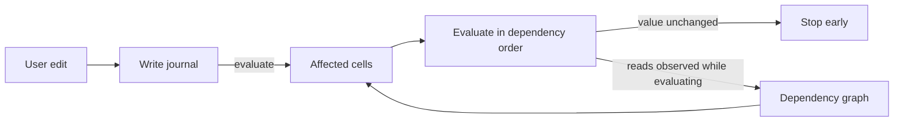

# Incremental recalculation

Incremental recalculation recomputes only the cells an edit affects, instead of the whole workbook. It is opt-in through `RecalcMode::Incremental`. The default stays full recalculation. Anything the incremental path does not model falls back to a full pass, so results always match full recalculation.

The engine records every write as it happens, observes what each formula reads while it evaluates, and uses the resulting dependency graph to recompute just the affected cells in dependency order. Recalculation stops early wherever a recomputed value turns out unchanged.



The design follows the same pattern as reactive UI libraries such as MobX, Vue, and signals. Dependencies come from watching real reads, and invalidation is pushed through the graph until an equality check stops it. The one difference is that recomputation is eager rather than lazy. Every cell of a spreadsheet is visible output, so deferring work never pays.

## Design rules

- No *write* reaches the graph except through the journal. `model/mod.rs` dirties the graph only from `drain_write_journal`, and the mutation paths (`actions.rs`, `undo_redo.rs`, `clipboard.rs`, `common.rs`) never touch it at all — both halves are held by the `graph_is_only_notified_by_the_journal` gate. The scheduler's own `mark_dirty` calls are not writes: they seed the pass with the always-dirty cells, the never-served cells, and the array anchors a full pass first observed, none of which any edit reports.
- Edges are the reads observed at evaluation time. There is no static analysis of formula text.
- A cell's value is a function of its inputs only. Modes choose which cells to evaluate, never what they evaluate to.
- Anything the model cannot represent falls back to full recalculation rather than approximating.

## How a pass works

`Model::evaluate` in incremental mode (`model/incremental.rs::evaluate_selective`):

1. Drain each worksheet's write log and derive the dirty set from it. A cell that stopped being a formula also drops its outgoing edges.
2. Add every cell that reads the clock or a random source, and every cell whose last result was not a function value (see below). Those are always dirty.
3. Collect every cell reachable from the dirty set through cell, range, and input edges.
4. If the pass cannot be modeled (see fallbacks below), run a full pass instead.
5. Evaluate the affected cells in topological order. While each formula runs, a tracer records what it reads; when it finishes, those reads replace its edges in the graph — or, when they are the reads it made last time, confirm the ones already there.
6. If a recomputed cell's value, type, and link are unchanged, nothing downstream of it is recomputed.
7. Cells outside the affected set are served their stored values. A formula whose live result is an empty cell coerces to `Number(0.0)` at the result boundary, before the value is stored — `FormulaValue` has no blank variant. So the stored value is exactly what a live read of that cell returns. That coercion is what makes the full pass itself order-independent (a same-pass reader sees the stored `0` whether it ran before or after the cell it reads), and it is the same reason serving a stored value never changes a result here — for every cell whose stored value is a function value.
8. Changes are accumulated for `Model::take_changed_cells`.

## Where things live

| File | Role |
|---|---|
| `recalc/journal.rs` | `Write` and `WriteLog`. Worksheet mutators push; `Model::evaluate` drains. Evaluation writes (storing a formula's result) are not journaled, because they are not edits. |
| `recalc/trace.rs` | `ReadSet` and `Input`. Records the cells, rectangles, and non-cell inputs one formula reads. A covering rectangle suppresses per-cell edges and widens the per-line and per-cell inputs read beneath it, so a walk's edge count is a property of its shape rather than of the height of the range it walked. |
| `dependency_graph.rs` | The graph itself: edges keyed by cell, range, and input, a banded range index (`SheetRanges`), `replace_reads`, `begin_rebuild`/`end_rebuild` (a full pass is a mark and a sweep, not a clear), `reachable_within` (the cone walk, which stops at the size its caller has already decided to fall back at), `topo_order`, `refresh_never_served` (the whole-graph cycle walk and the fact that says whether it is needed), `structural_edit`/`structural_move`, and `RecalcMode`. A structural edit shifts every index through `Shift`, applied field by field in `shift`, which destructures the struct so a new index cannot skip it. The two edits differ only in the `Remap` the shared `Displacement` carries — see "A move is a shift too" below. Also `SheetLayout`, the sheet numbering the stored positions are expressed in — see "Sheet numbering" below. |
| `model/eval_ctx.rs` | `EvalCtx`, the receiver `functions/` evaluates on. A newtype over `&mut Model` whose inner reference is private, so the only cell state a function can reach is the accessors re-exposed there, and every one of them records. |
| `model/incremental.rs` | The scheduler: `evaluate_selective`, `cone_is_plain` (the one predicate that decides whether a pass may be selective), `fanout_limit` (the one definition of the fanout guard, expressed as the size the cone walk stops at), `evaluate_full_to_fixed_point` (the settling loop every full pass runs through, in every mode), the frontier and whole-cone recomputes, and `FullPassRun`, which is the whole of "The cost contract" below. The *scheduling* decision lives here and only here; the evaluator's own mode branches are the `tracing()` gates in `model/mod.rs` and the dispatch in `Model::evaluate`. |
| `model/changed_cells.rs` | What counts as an observable change (`ChangeKey`), and the delta `take_changed_cells` reports. |
| `model/array_index.rs` | `array_footprint` and the walks that maintain the array/spill index and the formula count between full passes. |
| `model/unstable_cells.rs` | Rebuilds one of the two sets of cells whose stored value may not be served (below): the readers of blocked spill anchors, which is the set that needs stored cell state the graph cannot see. The other set, the cycle cone, is derived from edges alone, so the graph computes it itself (`cycle_cone`) and each scheduler installs it after its pass. |
| `model/cse_guard.rs` | The CSE member guard flag and the only scope that may suspend it. |
| `model/verify.rs` | The `RecalcMode::Verify` oracle. Compiled only under the `recalc_verify` feature. |
| `worksheet.rs` | The only producer of journal entries. `sheet_data` is written through mutators that push a `Write`. |
| `model/mod.rs` | `evaluate_cell` pushes a `ReadSet` frame, the `trace_cell`/`trace_rect`/`trace_input` helpers record into it, and a finished formula commits its reads to the graph. Tracing is gated on the recalc mode alone (`tracing()`), which is what lets a fallback borrow `Full`'s mode to run at `Full`'s cost — see "The cost contract". Also `evaluate_full`, whose two-phase order the incremental path must reproduce: `is_phase_one_cell` and `cells_in_order` are that order's one definition. |

## Cells that never serve a stored value

Serving a stored value is only sound when that value is a function of the cell's inputs. Two kinds of cell fail that test, and both are found by reading the state the last pass left rather than by matching a shape:

- **A cell on a dependency cycle and anything downstream of one.** A cycle has no fixed point: what its members hold is an artifact of which member the walk entered first, and a reader of one holds whatever it saw mid-cycle (`COUNT` swallows a `#CIRC!` into a number). Full re-derives all of it from scratch on every pass, so incremental seeds those cells dirty on every pass and recomputes them and their readers. The set is the cells `topo_order` cannot place (those on a cycle plus everything after one), rebuilt over the whole graph after each full pass and over the cone after each incremental one.

  Edges alone decide it, and that is exact rather than approximate. `evaluate_cell` records the read before any early return, including the one the incremental scope answers from the store, and a formula commits its reads on both exits, so every cross-cell read that can re-enter is an edge. The one edge the graph drops on purpose is a cell's read of *itself* (`replace_reads`: `if p != dependent`). A self-cycle has a single entry point, so what it holds *is* a function of the cell's inputs, and every non-self read it makes is still an edge, so anything that could move its value dirties it the ordinary way. Adding the cells whose stored value is `#CIRC!` on top of this changes no result, and costs a permanently dirty cell for every self-reference — and, for one inside an array footprint, a full pass for ever after.
- **A reader of a blocked spill anchor.** The anchor stores `#SPILL!` but hands a same-pass reader the live array's top-left value, so a reader recomputed against the stored error gets something a full pass never produces. Their stored values are served — they are what full computed — but recomputing one takes a full pass, which is the only pass that evaluates the anchor live, so a cone that reaches one falls back.

`RecalcMode::Verify`'s stored-vs-live check skips exactly these cells, because they are exactly the cells a one-cell scratch frame reading the store cannot reproduce. The two lists are the same list.

Cycle cells are recomputed on every pass but are not *reported* on every pass: the delta still names only the cells whose observable state moved. Full's `#CIRC!` placement can shift with any edit, and when it does the recompute sees it and the delta says so.

### The cone is derived from the edges, so it is derived when they move

Almost no workbook has a cycle, and until this round every full pass paid as if one might: `nodes()` collected the whole graph and `cycle_cone` ordered all of it, after every pass, to derive a set that was then usually empty. On the three shapes a traced full pass loses on, that tail *was* the loss — 60% to 84% of the whole gap to `Full` (see "What it actually costs").

The set is a function of the edges and of nothing else, so it only has to be derived when they move. `DependencyGraph::never_served_stale` is set by every mutator that moves one — `replace_reads` when it takes the rebuild path rather than recognising a formula that read what it read last time, `remove_dependent`, `replace_arrays` when the footprint index actually differs, `shift` — and `refresh_never_served` at the full pass's tail is the only thing that clears it, because it is the only thing that does the whole-graph walk. A workbook whose shape is not changing pays for the walk once and then not again, cycle or no cycle.

`begin_rebuild` no longer clears the set, and that is part of the mechanism rather than a side effect. Clearing it meant every full pass started by throwing away an answer it was about to recompute unchanged — and, until its tail ran, a graph with a cycle in it carried an *empty* never-served set, which is the dangerous direction. What replaces the clear is the fact: a pass that dies mid-way leaves a set that is either still right or is marked as not.

**Sticky-true is the safe way for the fact to be wrong**, which is why it is set by the mutators rather than inferred where it is read. An extra walk finds what the last one found and costs a pass a fraction of itself. A missed one leaves a cycle's members serving values that are artifacts of where the walk entered them, silently, for as long as the shape holds still.

Sticky-*false* is the direction that has to be impossible, and what makes it impossible is that the list of mutators is closed. The cone is a function of `precedents`, `cell_dependents`, `range_dependents` and `arrays`, and every write to any of the four is inside `replace_reads`'s rebuild path, `remove_dependent`, `replace_arrays` or `shift` — all of which set the fact. The one write that is not is the journal drain's `graph.arrays.insert`, and it is sound for a reason recorded at that call site: a footprint position enters the graph with no incoming edges, and a node no edge arrives at cannot lie on a cycle. The clear is in one place, immediately after the walk that earns it.

A cone-shaped answer — the one a selective pass installs from ordering its own cone — deliberately leaves the fact *set*. The whole-graph walk exists because a cycle no cone would seed still has to be known (I3.2), and a cone is not the whole graph, so a selective pass's answer stands until the next full pass without excusing that pass from its walk.

#### What was tried first, and why it is not what is here

The obvious cheaper fact is the pass's own `#CIRC!` witness: `saw_circular_reference` is set at the one place a walk can re-enter a cell it is still evaluating, so a full pass that never reached it traversed no cycle. Gating the rebuild on it is a third of the code and strictly faster — the acyclic case never walks at all, whatever the edits.

It is also wrong, and the way it is wrong is worth keeping written down. **Not every cycle in the graph is one the walk takes.** The graph over-approximates on purpose: a rectangle is recorded at the extent the reference declares (I1.3), so a function that reads a range's shape without reading its cells records an edge it never followed; and the array-footprint relay records a read of the anchor from the *index* (I1.9), which is followed only where the live cell is still that anchor's spill member. `cse_footprint_cycle_stored_value_diverges_from_a_live_reeval` is exactly the second case, and it fails under `Verify` within seconds of the gate being installed — a stored `0` against a live re-evaluation's `1`.

The reasoning that led there was a blacklist wearing a whitelist's clothes: it enumerated the ways a graph cycle could fail to be a walk cycle, argued each was benign, and missed one. "When a pass is allowed to be selective" says why that shape of argument is not allowed here — a case nobody thought of has to cost a full pass, not a wrong value. The fact that shipped asks a question with no such enumeration behind it: *did the edges move?*

## Array footprints are edges

An array anchor writes its spill members as evaluation writes, not edits, so nothing journals them. Reading a member is therefore recorded as a read of the anchor: the array index maps every footprint position to its anchor, and `evaluate_cell` records the anchor's position along with the position actually read — including a position whose spill cell a structural edit dropped, whose index entry survives until the next full pass refills it, and including reads that the incremental scope answers from the store. Without that edge a cycle running through an array footprint is invisible to the graph, and the cells around it look like ordinary results.

The index holds each anchor and each spill cell, not each anchor's declared rectangle. A CSE anchor owns a rectangle it refills whether or not the cells are there, but a *ghost* member — a declared position with no spill cell — only exists between the write that created it and the anchor's next evaluation, and that write dirties the anchor. The anchor is in the index, so the cone holding it goes full, and that is the pass that refills the rectangle. Indexing the rectangle would restate what the anchor's own entry already says.

## Non-cell inputs

Volatility is an input, not a list of functions. `NOW` records `Input::Clock`, `RAND` records `Input::Random`, `SUBTOTAL` records row visibility, `ROW()` records its own position, and `OFFSET`/`INDIRECT` record their resolved targets plus `Input::Computed` so structural edits re-run them instead of shifting a stale snapshot. Readers of `Clock` and `Random` are always recalculated. Whether a cell must be recomputed and whether it belongs in the change report are separate facts, so a deterministic formula next to a volatile one is never reported by mistake.

## When a pass is allowed to be selective

The default is the full pass. A pass is selective only when the engine can say positively that it may be, which is one predicate over the cone — `evaluate_selective`'s `cone_is_plain`. The cone is **plain** when:

- **P1** no cone member is in the array index. Spilling needs the full pass's two-phase ordering, and a spill member's value is its anchor's output rather than its own. This is the index rather than the cells, deliberately: it is what sees a *ghost* member, a declared footprint position whose spill cell a structural edit dropped, where the live cell no longer says "array" but the anchor still owns the position. It cannot miss a live one either — `array_footprint` is the single definition of what goes in, and every array cell reaches it: a user-written one through the journal drain, an evaluation-written one through the `wrote_array_cells` redo below, a moved one through `shift`. A dynamic anchor whose last result was a plain 1×1 scalar is not in the index and is plain, because `=LET(..)`, a called `LAMBDA` and `=INDEX(..)` are everyday formulas that must not cost a full pass.
- **P2** no cone member is a reader of a blocked spill anchor. Its stored value came from the live array's top-left, not from the anchor's stored `#SPILL!`, so recomputing it here would read the error instead. Only the full pass evaluates the anchor live.

A whitelist, not a blacklist of hazards, on purpose: under a blacklist a hazard nobody had thought of is a wrong value; here a case nobody thought of fails the predicate and costs a full pass. A missed case degrades to slow rather than to wrong.

Three clauses the predicate deliberately does **not** have, each because it would cost a case incremental wins today and buys no correctness:

- *No cone member in `never_served`.* A known cycle is seeded dirty on every pass, so it is in every cone, so this clause would send every workbook containing one cycle to a full pass forever — the `pathological-cycle` bench row is a large multiple over full today and would drop to parity. A cone with a cycle in it is handled by walking it in Full's own two phases instead — see the `#CIRC!` bullet below.
- *No structural op this drain.* Every row and column edit — insert, delete and move alike — shifts the indices in place and stays selective by design, so the clause would throw away the two rows that win on it (`structural: insert_rows` and `structural: move_rows`). See "A move is a shift too" below for the one of the three whose map is not monotone.
- *No volatile beyond the seeded always-dirty.* There is nothing to exclude: volatility is a recorded `Input`, every reader of one is in `always_dirty_cells`, and the pass seeds all of them before taking the cone.

Four things outside the cone predicate also send a pass to full:

- The graph is not ready: the first evaluation, or after sheet add/delete/rename, defined-name changes, locale, or timezone. No row or column edit lands here — an insert, a delete and a move all shift. For the sheet edits the convention is checked rather than assumed — see "Sheet numbering" below.
- The cone reaches more than half the workbook's formulas (with a floor of 1024, so small workbooks never fall back). This one is a performance choice, not a correctness one — which is why it is checked separately from plainness and why Verify disables it and not plainness.
- The pass reported `#CIRC!` for a cycle the graph did not already contain. The closing edge is only observed while the pass runs, so the cone was ordered without it and the error would land on a different cell than the full pass picks. A cycle the graph already knows about is walked by position instead, in the full pass's own two phases: array formulas first, then everything else, each row-major. That is the order the full pass walks in, and the cone contains every cell full could reach a cycle member through, because such a cell reads one transitively and so is a reader of an always-dirty cell. Since a known cycle is in every cone, this is also the walk a cycle *closing* on this pass gets when another cycle is already open — which is why phase 1 stays: the pass an anchor first falls inside a cycle, the anchor is not yet a seed, and only phase 1 makes full enter the cycle where it does.
- The pass itself wrote into an array footprint: a spill landed, a CSE range filled, or an anchor stored `#SPILL!`. This is the one hazard no pre-pass predicate can rule out. P1 admits a dynamic anchor whose last result was a plain 1×1 scalar; whether *this* pass's result is still 1×1 is not a property of any stored state, it is what the pass produces. An anchor that grows spills members the selective pass has no ordering for, so the pass is redone as full and `collect_array_cells` rebuilds the index exactly rather than patching it.

## The cost contract

Falling back is correct by construction — a full pass is what every mode runs — so what a fallback can get wrong is only the bill. And it did: a traced full pass pays for `Full`'s whole-workbook recompute **and** for recording what every formula read and rebuilding the graph from those reads. Measured on `bench_scenarios`, that investment was between 0.25 and 1.2 of a pass, so a mode whose reason to exist is to beat `Full` was, on its fallback rows, between a fifth and half again slower than it.

The investment buys exactly one thing: the next pass's selectivity. So it is worth paying when the next pass can spend it, and worth nothing when the next pass falls back too. Two mechanisms follow from that, and they are independent: make the investment smaller, and stop paying it on a run of passes that cannot spend it.

### Making the investment smaller

Where the cost lived was measured, not assumed. On a traced full pass over the `dashboard` and `long-chain` shapes it split roughly: **60% edge churn** in `replace_reads`, **20% the whole-graph cycle-cone rebuild** at the pass's tail, **20% the read-set allocation** — one `Vec` per formula per pass.

The churn was the whole graph being rebuilt from nothing every pass, and it was self-inflicted. `evaluate_full` used to clear every edge before it began, which made every stored read set unrecognizable, so `replace_reads` removed and re-added a workbook's worth of edges — freeing the dependents set of every precedent it emptied and allocating it back a moment later — even when nothing any formula read had moved. A full pass is now a **mark and a sweep**: `begin_rebuild` bumps a generation, `replace_reads` stamps every entry it writes *or re-confirms*, and `end_rebuild` drops what the pass never saw. The graph it leaves is the same graph, entry for entry, because a full pass evaluates every cell in the workbook — so a position that is still a formula re-records, and a position that is not cannot. What it no longer does is throw away the comparison that recognises the formulas which read exactly what they read last time, and on a workbook whose shape did not change that is nearly all of them.

That comparison is `ReadSet: PartialEq`, and its equivalence is exact rather than approximate: a remove followed by an identical add is the identity on all four edge maps, so the no-op path leaves precisely what the rebuild would have. It is order-sensitive on purpose — a walk that reordered its reads compares unequal and is re-recorded, which is the harmless direction to be wrong in.

Read frames are pooled (`Model::read_pool`) for the same reason: a formula's read set is built and then either compared away or cloned into the graph, so dropping it means allocating three vectors again for the next formula. That one matters most on the *selective* path, where it is an allocation saved per recomputed cell.

Together these take a traced full pass from about 1.9x `Full` to about 1.5-1.6x on the chain shapes and 1.2x on the spill shape. What was left after them was **not tracing at all**, and measuring that rather than assuming it is what the next two mechanisms came out of. Recording reads costs a traced pass between 5% and 34% over `Full` on the fallback shapes; the rest was two whole-workbook walks that a pass which is about to fall back has no use for.

### The cycle cone nobody needs

The first is the whole-graph cycle rebuild `nodes()` + `cycle_cone` ran at the end of every traced full pass. It was 60-84% of the entire gap to `Full` on the three fallback shapes — 0.97 ms of a 1.22 ms gap on `dashboard`, 4.07 ms of 6.76 ms on `long-chain`, 0.86 ms of 1.02 ms on `spill-heavy` — and on a workbook holding still it re-derived, every pass, the answer it already had. It is derived from the edges now, and so derived when they move: see "The cone is derived from the edges" above, including the cheaper fact that was tried first and is wrong.

### The cone nobody reads

The second is the cone itself. Before a pass can decide anything it walks the dirty set's dependents, and `evaluate_selective` then hands that cone to the fanout guard — which, on a workbook where one edit reaches every formula, rejects it. The walk had already built the whole thing.

So the guard is expressed as a **limit** rather than as a predicate over a finished cone, and the walk takes the limit and stops there. `Model::fanout_limit` is the one definition; `DependencyGraph::reachable_within` abandons the walk the moment the set reaches it and returns `None`, which the scheduler reads as the fallback it was going to take anyway. Stopping once the set *reaches* `formulas / RATIO` rounded up is exactly `cone * RATIO >= formulas`, so this is the same guard, decided at the same place, having done at most half the work — a cone bounded by half the workbook instead of by the workbook.

The saving is bounded by that ratio and cannot be better: the walk has to reach the limit to know it got there. What it buys is that the cost of *deciding* to fall back no longer scales with the workbook, only with the threshold. On `dashboard` that decision is what the median sample was paying; on `long-chain` it is now the smaller of the two remaining terms. Both are priced in "What is left, and where it lives".

`Verify` and workbooks under `INCREMENTAL_FANOUT_FLOOR` pass `usize::MAX`, which is the same "no guard" the predicate gave them.

### Not paying it on a run

`FullPassRun` in `model/incremental.rs` is the scheduler's memory of what the previous passes did, and the whole of the decision. Untraced means literally what `RecalcMode::Full` means: the pass runs through `Model::as_full_mode`, a `Drop` guard that borrows the mode for the duration, so every recording site — `tracing()`, the array-anchor edge in `evaluate_cell`, `commit_reads`, and the tail of `evaluate_full` that chooses between marking the graph ready and forcing a rebuild — is the *same* gate `Full` mode goes through rather than a second set someone has to keep in step. "At exactly `Full`'s cost" is true by construction. The delta an untraced fallback reports is `Everything`, which is what every fallback already reports.

**The bet is not symmetric, and that shapes everything else.** Untracing a pass saves the investment — a fraction of a pass. It costs a *whole* pass when the guess is wrong, because an untraced pass leaves the graph unready and the pass after it has no graph to be selective with. On a workbook where a selective pass is a hundredth of a full one, guessing wrong once undoes a dozen right guesses. So:

- **The run is watched before it is acted on.** Twelve full passes the scheduler *chose* — the graph was ready, the cone was there to be walked, and it went full anyway — before the first untraced one. A rebuild does not count: full was the only pass on offer, which says nothing about whether tracing pays, and the pass after a rebuild is commonly the pass that spends what it recorded. This is also what keeps a workbook that falls back once and goes on being selective (an array deleted, one wide edit among narrow ones) selective on the very next pass.
- **The run is acted on gently, and then less gently.** The first untraced stretch is one pass; every stretch the run survives doubles the next, up to sixteen. A run that ends early costs one wasted pass. A run that goes on pays the investment a logarithmic number of times, so its per-pass cost keeps falling.
- **`Verify` disables all of it**, exactly as it disables the fanout guard and for the same reason: both are performance choices, and the oracle exists to compare a *selective* pass against a shadow full one.

The untraced pass leaves the edges where they are rather than dropping them. A `MustRebuild` graph is never walked, so they can serve nothing, and the next pass that does trace re-records and sweeps — so keeping them is exactly as sound as clearing them, and it is what makes the traced pass at the end of a stretch cheap rather than a rebuild from an empty map.

### What it actually costs

The contract, priced, on a 4,000-cell chain whose every edit reaches the whole workbook:

| run of consecutive fallbacks | 40 edits | 80 | 160 | 320 |
|---|---|---|---|---|
| Incremental / Full | 1.24x | 1.15x | 1.07x | 1.06x |

With the hysteresis deleted, every one of those is about 1.6x. So:

> A selective pass is cheaper. A traced full pass costs `Full` plus a one-time investment, paid only while the passes before it leave any prospect of spending it. A *run* of full passes pays that investment a logarithmic number of times, so the longer the run the closer it costs to `Full`'s price — and a run that turns out not to be one costs a single wasted pass to find out.

Short runs are the case this deliberately loses. The engine is still watching at forty edits, and it is watching because guessing early is how you spend a hundred selective passes to save a dozen tracing ones.

That price is paid somewhere else too, and it is worth naming. The differential fuzzer holds itself to a floor — at least half its non-volatile evaluates must stay selective, or the oracle is comparing `Full` against `Full` — and untraced passes spend exactly that. Over 60 seeds x 200 steps the engine without this mechanism reaches 55%, and with it 54%; at `CHOSEN_BEFORE_ACTING = 6` it reaches 52% and misses the floor outright on the 30 x 150 `Verify` configuration. Both constants were chosen against that number, not against the bench alone, and the bench barely notices the difference — the arming passes are a shrinking share of a long run.

And on the `bench_scenarios` shapes, which is where the problem was named. Speedup is `Full` over `Incremental`, so 1.00x is parity and the fallback rows are the ones that were below it:

| fallback row | before | after |
|---|---|---|
| `dashboard (wide fanout)` | 0.34x | 0.48x |
| `long-chain, edit head` | 0.47x | 0.64x |
| `spill-heavy` | 0.79x | 0.94x |
| `whole-column aggregates` | 0.91x | 0.98x |
| `structural: move_rows` | 0.39x | 0.63x |

None of those reach parity, and the reason is in the two mechanisms rather than in the measurement. `bench_scenarios` medians twenty samples of a twenty-five-pass series, and twelve of those passes are the ones the run spends proving itself, so the median still lands among them; `bench_amortized_runs`, over eighty edits, reads 0.73x, 0.74x and 0.92x for the first three. `structural: move_rows` moves at all only because of the smaller investment — its passes are rebuilds, so its run never arms, on purpose.

Taking the two whole-workbook walks out of the fallback pass moved them again. Both columns are medians of three interleaved runs on one machine, so they are comparable with each other and not with the table above:

| fallback row | before | after |
|---|---|---|
| `dashboard (wide fanout)` | 0.58x | 0.87x |
| `long-chain, edit head` | 0.64x | 0.81x |
| `spill-heavy` | 0.91x | 0.98x |
| `whole-column aggregates` | 0.96x | 0.98x |

and over eighty edits, where the investment is inside the number: `dashboard` 0.85x → 0.95x, `long-chain` 0.87x → 0.93x, `spill-heavy` 0.95x → 0.98x. No winning row moved: `sparse-workbook` 145x → 148x, `financial-model` 14.9x → 15.0x, `pathological-cycle` 151x → 142x, `structural: move_rows` 14.9x → 15.1x.

### What the single-edit median is actually a median of

Worth writing down, because it is why the two bench rows move by different amounts and why the cone walk was worth attacking even though it is not the largest term.

`bench_scenarios` takes twenty samples of a twenty-five-pass series, and on a shape where every pass falls back those samples are four populations, not one. The run arms over twelve chosen-full passes and then untraces in stretches of one, two, four, eight — so of the twenty sampled passes nine are traced and eleven are not. And a pass walks a cone only when the graph is ready, which is only after a *traced* pass. The samples are therefore about seven at `Full`'s cost, four at `Full` plus a cone walk, three at `Full` plus the recording, and six at `Full` plus both; the median lands in the middle bands rather than on either end.

### What is left, and where it lives

Two rows still sit under parity, and what remains is now one term per row rather than a mixture. Measured on one traced pass of each shape against the same pass run untraced, which is `Full`'s cost by construction:

| | `dashboard` | `long-chain` | `spill-heavy` |
|---|---|---|---|
| the pass, untraced | 2.50 ms | 14.5 ms | 4.01 ms |
| the cone walk the guard needs | 0.47 ms (19%) | 2.07 ms (14%) | — under the floor |
| recording what every formula reads | 0.48 ms (19%) | 4.99 ms (34%) | 0.19 ms (5%) |
| sweeping the rebuild (`end_rebuild`) | 0.08 ms (3%) | 0.55 ms (4%) | 0.13 ms (3%) |
| the cycle cone | 0 | 0 | 0 |

**The cone walk cannot go below half.** The walk has to reach the limit to know it got there, so half the workbook is the floor for that term and not an implementation detail.

**Recording is where the rest is, and it is not the construction.** Of the recording cost, `replace_reads` is 73-78% on the two rows that miss — but on a workbook whose shape is holding still it is *already* the compare-and-return path that builds nothing. Timed inside it, the whole of that is one `HashMap<Position, Precedents>` lookup: 139 ns per formula against 27 ns for the `ReadSet` comparison on `long-chain`, 60 ns against 22 ns on `dashboard` (both inflated by about 20 ns of timer). The lookup is a random probe into a map holding an eighty-byte entry per formula — 1.6 MB on the chain, well past L2 — so it is a cache miss per formula, and *any* scheme that has to find a formula's previous read set pays it.

That rules out the obvious next mechanism rather than recommending it. Collecting read sets into flat buffers and building the four edge maps in one batch would batch a construction that is not happening, add a copy of every read set to do it, and still need the same per-formula lookup to know which entries were unchanged. The lever on this term is the *storage* of `precedents` — a cheaper hash, or an entry dense enough that the probe is not a miss — which is a change to the graph's core types and a bigger piece of work than the one measured here.

### What measures it

`bench_scenarios` reports a median over twenty-five passes, which is what one edit costs in a settled series and cannot see an amortization at all. `bench_amortized_runs` in the same file is the contract's own instrument: forty consecutive edits on a freshly built workbook, timed end to end in both modes, with the investment inside the number. The wall-clock assertion is `consecutive_fallbacks_cost_what_full_costs` in `base/tests/recalc_cost.rs`.

## One `evaluate` settles

A single two-phase pass is not a fixed point. Phase 1 spills the arrays and phase 2 evaluates the rest, but `evaluate_cell` recurses, so a phase-2 formula can be pulled in early and read a footprint position before its anchor refills it — after a row move, a delete, or a first spill. That reader then holds a value the same inputs would never produce again, and only a *further* whole-workbook pass repairs it.

`evaluate` runs that further pass itself. `evaluate_full_to_fixed_point` repeats the two-phase pass while the pass it just ran changed the array footprint, so what `evaluate` returns is the settled state rather than the first approximation of it. Excel settles fully per recalculation; this is the same contract.

**The condition is footprint *membership*, not footprint values** (`settled_footprint`). What strands a reader is a position changing hands — appearing, vanishing, or moving to another anchor. A reader of a position that stayed a live spill member cannot have been served a pre-write value, because `evaluate_cell`'s `SpillCell` arm evaluates the anchor before returning the member. Comparing values instead is both too weak and too strong: too weak, because the pass that *first* indexes an array has no previous value for any of its positions and would call itself settled on the strength of having compared nothing — the state every workbook loaded from bytes is in; too strong, because `RANDARRAY` re-rolls every pass by definition and would be asked to converge to a fixed point it does not have, spinning to the bound on every evaluate. Membership answers both: a first index is a membership change, a re-roll is not.

There is no test for whether anything *read* the moved position either. Edges exist only in the tracing modes, so a reader test would settle `Incremental` and leave `Full` one healing window behind, which is the one divergence this engine may not have. An extra pass over a footprint nothing read recomputes the same values and stops.

The comparison reads the array index, so the index is rebuilt after a full pass in *every* mode — it is settling machinery, not edge machinery. **A pass that evaluated no array cell and was handed an empty index skips that rebuild**, which is what keeps a workbook with no arrays from paying for any of this: the rebuild is the only whole-workbook walk the settling machinery costs, and with the index empty the comparison is two empty sets. It is sound because a full pass walks every stored cell — if none of them was a `Cell::ArrayFormula` or a `Cell::SpillCell`, the correct index is empty, which is what it already is. Both halves of the gate are load-bearing: the *evaluated* half because a workbook that arrives whole has arrays in its cells and nothing in its index, and nothing else would ever build it (`a_loaded_workbook_settles_on_its_first_evaluate`); the *index* half because the journal drain only ever adds to the index, so the pass after the last array is deleted is the one walk that clears what it left (`deleting_the_last_array_clears_the_index`). `evaluated_array_cells` is set by the evaluator itself, in both modes, and never derived from tracing or the graph — a mode-dependent gate would give the two modes different fixed points.

Termination: iteration *k*+1 runs the same deterministic pass over iteration *k*'s output and stops as soon as membership comes back unchanged. Membership is a function of the evaluated workbook, so it is stable one pass after the anchors that determine it are; each re-run resolves one layer of anchor-reads-anchor, and the cascade is bounded by the depth of that chain. Every shape found so far settles in two. `MAX_SETTLING_PASSES` (4) is the belt: past it a debug build asserts loudly and a release build stops, identically in both modes, so the modes still agree.

## Sheet numbering

A `Position`'s sheet component is an *index* into `workbook.worksheets`. Adding, deleting, duplicating or moving a sheet renumbers the sheets after it, so every position the graph stores — edges, precedents, array anchors, `never_served`, the dirty set — moves onto a different sheet at once. Nothing about the stale coordinate looks wrong: the stale index still names a live sheet, so a walk over the stale graph returns confident wrong answers rather than failing.

What stops that is `reset_parsed_structures` calling `invalidate_graph`, which every sheet edit routes through. That is a convention, and `SheetLayout` is the check that it held. The graph records the **sheet-id sequence** it last ran under; `Model::evaluate` compares it against the workbook's current one before dispatching a pass. A sheet id is allocated once at creation and never reassigned, so the sequence changes under exactly the edits that renumber: an insert or delete resizes it, a move permutes it, and a rename — which changes formula text, not numbering — leaves it alone and is covered by the reparse's own invalidation.

The layout is *derived* rather than counted, which is the whole point of the shape. There is no generation to bump, so there is no bump for a new sheet-CRUD path to forget: such a path is checked the moment it lands, without its author knowing this mechanism exists. A mismatch against a graph that still holds edges is a `debug_assert` failure — the edit that skipped the invalidation is the only place worth reporting, since the corruption is otherwise silent — and in release builds the graph is downgraded to `MustRebuild`, so a shipped workbook gets the correct full pass the missing `invalidate_graph` should have asked for instead of being served stale edges.

This detects staleness; it does not make it unrepresentable. The stronger move — keying positions by stable sheet ids so renumbering stops existing — was assessed and deferred; see Follow-ups.

**Kill-proof.** The mutant is `delete_sheet` reparsing but not invalidating: the sheet arm of I8.1 with the convention removed and nothing else touched. It survives the entire lib suite in every mode; the only thing that catches it without this mechanism is the differential fuzzer, which finds it on seed 1 and minimizes to six operations (two `AddSheet`s, a write to the third sheet, evaluate, `DeleteSheet`, evaluate), surfacing as a missing delta entry for a cell on a sheet that no longer exists. With the mechanism it dies deterministically across the sheet-CRUD tests (`test_sheets`, `test_add_delete_sheets`, `test_move_sheet`, `test_defined_names`, `test_duplicate_sheet`, `test_sheets_undo_redo`), each reporting the edit that skipped the invalidation rather than a divergence at whatever cell happened to read the stale edge first. That is what puts the clause outside the **oracle** column: not a new witness, a mechanism that makes hunting for one unnecessary.

## A move is a shift too

An insert or a delete moves everything at or after a boundary by a constant. A row or column *move* is the third member of that family and not a different kind of edit: the line at `from` lands on `to`, the lines it passes close up behind it by one, and everything outside `[min, max]` stays. `Displacement` carries which of the two maps applies (`Remap::Band`, `Remap::Move`) and every stored coordinate goes through the same `shift`, so the move gets the destructuring safety net for free — a new index cannot be added without deciding how it moves under *both*.

The move never sees a K-line band. `move_rows_action` decomposes a K-row move into K single-row moves and records a `RowMove` for each, so the graph is only ever asked to model one line changing places.

**The move map is a permutation**, and everything else follows from that. It creates and destroys no line, so no stored entry is dropped and none can collide, and a move needs no counterpart to the insert/delete shrink guard (`range_overlaps_band`, I5.3): a delete can take rows out of the middle of a tracked range, which two shifted corners cannot express, but nothing is taken out here.

**A range is the one thing it cannot always name.** The map is not monotone — the moved line jumps its band — so the image of a range with one end inside the band and the other outside is an interval with a hole in it. `Displacement::span` returns the hull. The two failure modes are not symmetric: a widened range costs a redundant recompute, a narrowed one stops dirtying a reader that a later write still reaches. Widening is also strictly available, because a permutation's image of *n* lines is *n* lines, so the hull can never come back narrower than the span it was given. Rebuilding instead — I5.3's answer for the delete — would be the end of incremental moves in practice: a workbook of windowed aggregates (`=SUM(B4:B13)`) straddles the band ten times over on every move.

**Who the shifted edges serve, and who serves them instead.** Everything the move touches is journaled. Every position inside the band that held a cell or receives one is written — filled by `move_cell` and `rebuild_moved_cells`, vacated by the `remove_cell` that lifts a cell out — and a position that was empty and stays empty is one no content passed through. Every formula whose *text* the move changed is rewritten through `write_displaced_formula`, which is every literal reference with an endpoint inside the band (`move_coord(x) == x` exactly when `x` is outside it, and the stringifier displaces each endpoint by that same map). Links move and journal too. So every cell holding a stored edge with an endpoint inside the band is a seed of this pass and re-records its reads from scratch, and an edge wholly outside the band is one the move did not touch. There is nothing left for the shift to repair.

That is a *structural* subsumption argument and it is confirmed by measurement rather than assumed: collapsing `move_coord` to the identity survives the whole lib suite in all three modes and the differential fuzzer, and so does skipping the shift and the dependent marking for a move entirely (~15k fuzzed operations in each case). The move's shift is therefore a **redundant second path**, of the same kind as I5.4's four extra halves, and it is kept for two reasons that are not about this pass's answer:

- The destructuring `shift` obliges every index to say how it moves, and "not at all" is not an answer a move can give: the graph would be numbering positions by a layout the workbook is no longer in, which is the exact failure `SheetLayout` exists to catch on the sheet axis.
- Nothing else ever *cleans* what a move leaves behind. A formula that moved re-registers under its new key, so `remove_dependent` is never called for its old one; `precedents` keeps that entry and the phantom edges it names for the lifetime of the model, growing every cone that reaches them. It is the unbounded-growth argument `SheetRanges::deindex` is there for, one edit up.

`mark_structural_dependents` is the other half of the same belt, and the second measurement above covers it too. What it is nominally for is the shapes whose *text* is displacement-stable — computed references, defined names, `ROW()`, `FORMULATEXT`, and a hidden flag arriving on a different line, which `move_row_unchecked` rewrites without journaling — and the journal reaches those as well, through the band positions those readers have edges on. The move gets it through the same band argument the insert and delete use: `[min(from, to), max(from, to)]` where theirs is `[boundary, ∞)`. That is the only per-edit thing about it, which is why it takes the band rather than the boundary.

**The delta says `Everything`,** the same as an insert or delete and for the same reason: a move changes cells' *addresses*, and `take_changed_cells` reports positions. The cells whose content moved are not all dirty (a moved data cell is not), and there is no position list that means "this content is now over there", so `structural_unknown` is set and the pass after a move reports `Everything` (I6.3).

## Intentional divergences

Two places where this engine deliberately does not reproduce what the pre-engine `Model::evaluate` did. Everything else is bug-for-bug identical, and a difference that is not in this list is a defect.

- **A blank formula result is `0`, not blank.** A formula whose live result is an empty cell coerces to `Number(0.0)` at the result boundary, before the value is stored. The baseline was *order-dependent*: a same-pass reader that ran before the blank-returning formula saw `Empty`, one that ran after saw the stored `0`. Excel caches a blank result as `<v>0</v>`, so `0` is both the Excel answer and the one that makes the full pass order-independent — which is what lets a stored value be served at all (I3.6, `stored_empty_formula_is_live_zero`).
- **One `evaluate` settles.** Where the baseline needed a second `evaluate` to heal a reader that had read an array footprint before the anchor refilled it, one `evaluate` returns the healed value. The observable sequences that differ are exactly the previously-unsettled healing windows, and only within them: for a workbook where the baseline's pass *N* left a footprint moving under a reader, this engine's pass *N* holds what the baseline's pass *N*+1 held. Values are strictly more converged, never less — the extra work is the baseline's own next pass, run early. Outside such a window nothing changes, and a workbook with no arrays has no such window at all. Excel settles per recalculation, so this is Excel parity (`one_evaluate_settles_a_footprint_moved_under_a_reader`).

  Both recalc modes settle, so this is not an `Incremental` ≠ `Full` divergence and the differential fuzzer — which compares a `Full` model against an `Incremental` model — is unaffected by it.

## Testing

```bash
# Full suite, default full recalculation
cargo test -p ironcalc_base --lib

# Full suite with incremental recalculation forced on
IRONCALC_RECALC=incremental cargo test -p ironcalc_base --lib

# Same suite plus a shadow full-recalculation pass that asserts both agree
IRONCALC_RECALC=verify cargo test -p ironcalc_base --features recalc_verify --lib

# Randomized comparison of both modes in lockstep, as run in CI
cargo test -p ironcalc_base --test fuzz_differential -- --nocapture

# Benchmark: cost of a single edit, incremental vs full
cargo test -p ironcalc_base bench_incremental --release -- --ignored --nocapture

# Benchmark: cost of a *run* of edits, which is what the cost contract is about
cargo test -p ironcalc_base bench_amortized_runs --release -- --ignored --nocapture
```

`RecalcMode::Verify` (behind the `recalc_verify` feature) runs the incremental pass, asserts that the change report lists every change and nothing else, asserts every stored formula value equals a live re-evaluation, then runs a full pass on a snapshot and compares, so the check cannot repair the state it is checking.

## Invariants and their witnesses

The suite here is large next to the engine, and the only thing that makes that defensible is that every test is the minimal witness of a named clause. This section is the map: nine invariants, the clauses each decomposes into, what enforces each clause, and — where the answer is "a test" — which test.

Four things can enforce a clause, and only two of them owe a test:

| | What it means | Owes a test |
|---|---|---|
| **construction** | The type system, a privacy boundary, or the shape of the code makes the violation unrepresentable. | No. A test here asserts what the compiler already says. |
| **gate** | A grep-gate in `test/test_recalc_invariants.rs`, or a `clippy.toml` `disallowed-methods` entry. | No — the gate is the witness. |
| **test** | Nothing but a test sees it. | Yes: one witness, named below. |
| **oracle** | `RecalcMode::Verify` and the differential fuzzer find it over shapes nobody enumerated. | Only a deterministic fast gate, and only where it kills something no kept test kills. |

`base/tests/common/` — the generator, the lockstep harness, the minimizer — is the mechanism behind the **oracle** column. It is the largest file in the suite and it is tooling, not tests. It plants SUMIFS, OFFSET/INDIRECT and SUBTOTAL shapes and a volatile zoo on every run, which is why one deterministic witness per clause is enough here and a second shape of the same clause is not. Its op space is not only edits: a rare `SaveLoad` step replaces every model in the lockstep set by `from_bytes` of its own `to_bytes`, so the deserialization path — cells with no journal behind them, a `MustRebuild` graph, an unknown formula count — is searched by the same sequences rather than only by hand-written witnesses, and the delta read across one — at the load, and again after the pass that follows it — is required to be `Everything` both times.

### I1 — every evaluation read records an edge or an Input

| Clause | Enforcement | Witness |
|---|---|---|
| I1.1 A cell read is recorded before any early return — the scope gate that answers from the store, and the `#CIRC!` return | construction (`trace_cell` is the first statement of `evaluate_cell`) | — |
| I1.2 A function implementation reaches cell state only through the recording accessors | construction (`functions/` runs on `EvalCtx`, a newtype over `&mut Model` with a private inner reference; it has no `workbook` field and no untraced getter, so the bypass does not compile) | — |
| I1.3 A rectangle is recorded at its declared extent, not the extent the walk visited: `SUM(B:D)` clips its per-cell walk to the used range, so only the rect connects a write outside it | test | `multi_column_range_edits_propagate` (three columns wide, so it kills both a >1 and a >=3 rect drop); the run-time-widened case is `incremental_sumifs_reads_resized_criteria`; the `#` operator's edge on a not-yet-written anchor is `spill_hash_of_empty_anchor_sees_later_formula` |
| I1.4 Each volatile or environment function records its `Input` | test, one per variant | Random: `volatile_rerolls_across_repeated_incremental_passes`. Clock: `clock_volatile_is_reported_on_every_incremental_pass`. OwnCoord: `incremental_argless_row_updates_after_insert` |
| I1.5 Reading a cell's formula text or formula-ness records `FormulaText` — three independent call sites | construction (all three ways in — `EvalCtx::get_cell_formula`, `get_english_cell_formula`, `formula_index_at` — record it themselves) | — |
| I1.6 Reading row visibility records `RowHidden`, keyed to the rows read: the one row for a lone read, the rect's rows for a read beneath a recorded rect (I1.11) | *that* it records: construction (`EvalCtx::row_hidden` is the only way in and traces first). *Which rows* it keys on: test | `subtotal_sees_hidden_row_it_scans_not_own_row` — hiding the scanned row re-runs it, hiding its own row, outside the rect, does not |
| I1.7 Reading a defined name records `Name` | test | `name_reader_redirty_on_insert` |
| I1.8 A reference-returning function's resolved target becomes an edge, at the extent it resolved to | test; the extent is one per call site | `offset_target_change_without_static_edge`; the extent is `offset_records_its_resolved_extent_not_the_walk` and `indirect_records_its_resolved_extent_not_the_walk` (I1.3's clipping rule, reached through a computed extent) |
| I1.9 Reading an array-footprint position records an edge on its anchor, taken from the array index and recorded ahead of the scope gate | test | `cse_footprint_cycle_stored_value_diverges_from_a_live_reeval` (dies only under `recalc_verify`) |
| I1.10 A formula commits its reads on both exits | construction | — |
| I1.12 A full pass keeps an entry for the formulas it evaluated and for nothing else: one whose position stopped being a formula with no journal write to say so — a renumbered sheet, a spill that overwrote it — is swept | test | `a_full_pass_keeps_only_the_formulas_it_evaluated`. Nothing in the value suite sees it: a leftover entry only ever *adds* edges, so the cone is a superset and every value stays right, and what it costs is a graph that grows without bound |
| I1.11 A range read records a bounded number of edges whatever its height: the per-cell reads under a recorded rect are suppressed, and the per-line and per-cell *inputs* under it widen to it. The economy is I1.3's, applied to every walk and not only the folds | construction (`ReadSet::record_cell` / `record_input` are the only ways in, and both consult `rects`) | `a_range_walk_records_a_bounded_number_of_edges` (edge counts equal at 10 and 400 rows, per walk); the cost it buys is `incremental_costs_no_more_than_full_over_whole_column_aggregates` in `base/tests/recalc_cost.rs` |

Two reads in `functions/` are routed through `EvalCtx::sheet_dimension` and
`EvalCtx::defined_name` — the financial whole-column clip and
`SHEET(a_defined_name)` — so that I1.2 has no exceptions. Neither is a wrong
answer without the routing, and neither has a witness, because neither *can*
be one:

- the clip's declared rect is recorded whole when the `RangeKind` node is
  evaluated, before any function clips its walk (I1.3), so the rect already
  covers every write that could move the result. Delete that `trace_rect` and
  a whole-column `NPV` does go stale — which is I1.3's witness, not a new one.
- every defined-name edit calls `invalidate_graph`, so a name reader is never
  served from the store at all.

They are routed for one reason only: so that "every accessor on `EvalCtx`
records" has no exceptions to remember.

### I2 — every user mutation journals; the pause is guard-scoped

| Clause | Enforcement | Witness |
|---|---|---|
| I2.1 A no-op write and a style-only materialization are not edits; a write that changes state is one even when the formula index does not move | test | `style_on_blank_cell_does_not_enter_the_delta`, `blocked_spill_reset_on_insert_below_matches_full` |
| I2.2 Nothing outside the journal drain dirties the graph | gate | `graph_is_only_notified_by_the_journal` |
| I2.3 Recording is paused only through a `#[must_use]` Drop guard | construction (`set_recording` is private to `mod journal`) | — |
| I2.4 A displacement journals a value write substituted for the suppressed formula write | test | `incremental_handles_row_delete` |
| I2.5 A batch's pre-batch formula-ness is read off its first entry, so the journal-maintained formula count agrees with a recount | test | `journal_accounts_a_batch_against_its_pre_batch_state` |
| I2.6 A cell that stops being a formula loses its outgoing edges, through every write API | test | `journal_value_over_formula_drops_edges` |
| I2.7 Overwriting a cell re-dirties the readers of its formula text | test | `formulatext_sees_value_overwrite_of_its_argument`, `isformula_sees_value_overwrite_of_its_argument` |
| I2.8 A link write and a link removal journal, from each producer, including a link stranded at a position with no cell | test, one per producer | `cell_link_write_is_reported_in_the_delta`, `range_clear_reports_a_stranded_link_removal` |
| I2.9 A hidden-flag write dirties the readers of that line | test | `incremental_subtotal_sees_hidden_row` |
| I2.10 A rejected write journals nothing | test | `journal_rejected_write_logs_nothing` |
| I2.11 Undo's writes journal, including through a paused evaluation | test | `incremental_undo_under_pause_stays_correct` |

### I3 — a stored value is served only where it is a function of that cell's inputs

| Clause | Enforcement | Witness |
|---|---|---|
| I3.1 Cells on a cycle and everything downstream are seeded dirty every pass | test + oracle | `covfuzz_count_offset_cycle_lost_after_number_overwrite` |
| I3.2 That set is rebuilt over the whole graph after a full pass, so a cycle no cone would seed is still known; a cone-shaped answer never satisfies it | test | the same shape (it dies to both mutants), and `cse_footprint_cycle_stored_value_diverges_from_a_live_reeval` under `Verify` for the whole-graph half |
| I3.7 That rebuild is skipped only where the edges have not moved since it last ran, which every mutator that moves one says so: sticky-true is safe and slow, sticky-false serves a cycle's artifacts | test | `the_cycle_cone_is_re_derived_only_when_the_edges_move` — asserts on `DependencyGraph::cycle_scans`, because "no ordering ran" is work *not* done and no value or `never_served` assertion can see it. Its shape is a wide fanout so that every pass reaches the full pass's tail; the same test on three cells passes with the mechanism deleted |
| I3.3 A blocked (`#SPILL!`) anchor stays in the array index | test | `a_blocked_anchors_reader_is_recomputed_only_by_a_full_pass` |
| I3.4 The blocked-reader set is rebuilt on every full pass | test | the same |
| I3.5 Verify's stored-vs-live skip list is the never-served list | construction | — |
| I3.6 A blank formula result is stored as the 0 a live re-evaluation produces | test + oracle | `stored_empty_formula_is_live_zero` |

### I4 — the selective pass produces Full's result, pass for pass

| Clause | Enforcement | Witness |
|---|---|---|
| I4.1 The cone is closed under cell, range and input dependents; the banded range index answers the point query exactly and prunes what it drops | test + oracle | `range_index_matches_brute_force`, `removing_last_dependent_prunes_the_index` |
| I4.2 The acyclic cone is ordered by edges, not position | test | `acyclic_cone_orders_a_scalar_anchor_by_edges_not_position` (the anchor sits *below* its reader, so a positional walk gets it wrong) |
| I4.3 The known-cycle cone is walked in Full's own two phases | test | `new_cycle_around_an_anchor_places_circ_like_full_phase_one` |
| I4.4 Each cone cell is evaluated at most once per pass | test | `incremental_does_not_re_evaluate_a_mid_cycle_cell` |
| I4.5 The change key is `(type, number bits, link)`, and the cutoff stops at a cell whose key did not move | test, one per component | `incremental_propagates_error_to_text_transition`, `incremental_reports_signed_zero_flip`, `incremental_reports_dynamic_link_retarget`; the cutoff itself is `incremental_reports_only_value_changes` |
| I4.6 Edges are the reads of *this* pass, replacing the last pass's | test | `incremental_tracks_dynamic_branch_dependencies` |
| I4.7 An out-of-cone read is answered from the store | construction + oracle | — |
| I4.8 A cell that no longer resolves to `HYPERLINK` drops its link | test | `incremental_rebuilds_dynamic_links` (in `test_fn_hyperlink.rs`) |

### I5 — a structural edit rewrites every positional index

The remapping is deliberately conservative: an index that keeps a stale entry costs a redundant recompute or one full fallback, never a wrong value, because a dirtied cell re-records its reads from scratch. That argument covers *which* entries survive; it does not cover *where* they land, so the comparisons that decide that are pinned directly, one clause per edit.

| Clause | Enforcement | Witness |
|---|---|---|
| I5.1 No positional index is forgotten | construction (`DependencyGraph::shift` destructures `Self`) | — a test asserting "index X shifted" is tautological and is not kept |
| I5.2 The reverse index (`precedents`) and the dynamic-link map move with the cells they key | test | `incremental_structural_edit_moves_volatile_with_the_graph`, `incremental_insert_moves_hyperlink_with_the_cell` |
| I5.3 A delete that would only shrink a tracked range rebuilds instead of shifting — and both ends of that overlap test are exact | test | `incremental_row_delete_shrinking_range_forces_full`; the band edges are `shrink_detection_is_exact_at_the_band_edges` |
| I5.4 A structural edit dirties what can change with no precedent moving | **redundant second path** — see below | the journal is the primary; `name_reader_redirty_on_insert` covers the name half by way of its cell edge |
| I5.5 The remapping rule is exact at the edit boundary | test | `displacement_remaps_at_the_edit_boundary` |
| I5.6 A move's remapping is a permutation for a cell, and never names fewer positions than it was given for a range | test | `move_remaps_by_permutation_and_widens_what_it_cannot_name` |
| I5.7 A move shifts instead of rebuilding, and a reader outside the moved band sees the reordering | test | `incremental_row_move_reorders_a_reader_outside_the_band` |
| I5.8 That shift and its dependent marking are a **redundant second path** — see "A move is a shift too" | the journal is the primary | — |

**On I5.4.** `mark_structural_dependents` marks four things beyond the cell-edge half: range dependents, `Name`/`SheetStructure`/`Computed` readers, and `OwnCoord`/`FormulaText` readers. Each of the four can be deleted with nothing failing, and so can all four at once — the dirty set after an insert is still non-empty and still correct. The primary path is the journal, in two parts: `displace_cells` rewrites and journals every formula whose *text* the edit changes (which is every literal range that moves, and which re-dirties `FORMULATEXT` readers through the drain's own text-reader marking), and the worksheet's row/column shift journals every non-blank cell that physically moves, so ordinary reachability through the already-shifted edges reaches the dependents of everything that moved — through a rectangle included. A computed reference is the sharpest case and it resolves the same way: `=OFFSET($C$1,5,0)` above an insert keeps its text, but the cells it resolves through are journaled, and its shifted rect still reaches one of them.

The four are kept anyway, as belt over braces, because the subsumption argument is empirical rather than structural: it says the journal happens to cover every shape anyone has constructed, not that it must. The oracle is what carries them — `base/tests/common/` plants whole-column reads on the data columns, defined names targeting whole columns and rows, bounded counts that notice a blank an insert adds, and `OFFSET`/`INDIRECT`/`ROW`/`FORMULATEXT` forms whose text is displacement-stable, which is exactly the shape class where the journal is silent and only this marking speaks.

Planting that shape class depends on every aggregate range walk going through `EvalCtx::clip_range_to_used` — including the whole-row form, whose *column* axis is the one nothing else clips. An unclipped `COUNTA`/`COUNTBLANK`/`COUNT`/`SUBTOTAL`/`AVERAGE`/`MAX`/`MIN` walks all 1,048,576 rows of a whole-column reference, which costs enough per evaluate to price those templates out of the generator entirely. The cost clause is `whole_column_aggregate_cost_tracks_the_used_range` in `recalc_cost.rs`; the one function whose answer depends on the clipped-away cells is `COUNTBLANK`, whose remainder arithmetic is `countblank_adds_back_the_cells_the_clip_removed`.

### I6 — the delta is sound and complete

| Clause | Enforcement | Witness |
|---|---|---|
| I6.1 Delta ⊇ moved; Delta ⊆ moved ∪ seeds ∪ volatile cone; a user edit is reported even when its own value did not move; dirty is not report | oracle + test | `subtotal_formula_text_reread_is_not_always_reported` |
| I6.2 Every always-dirty cell is reported on every pass, asserted against the **pre-pass** set | oracle; the pre-vs-post choice is test | `verify_liveness_allows_a_cell_that_becomes_volatile_mid_pass`, `verify_liveness_still_binds_when_a_cell_leaves_volatility` |
| I6.3 `Everything` where a cell list cannot name what moved, and the flag dies with its pass | test | `take_changed_cells_reports_everything_for_data_only_shift`, and `take_changed_cells_reports_everything_for_trailing_delete` for the Ready-with-empty-dirty branch |
| I6.4 A redundant full pass keeps the delta it inherited unless values moved; a volatile makes them move | test | `take_changed_cells_survives_redundant_evaluate`, `redundant_evaluate_keeps_rand_reporting_but_not_sumifs` |
| I6.5 A conditional-format result that moves enters the delta, whether a value drove it or a rule edit did | test, one per driver | `incremental_reports_conditional_format_change`, `incremental_reports_cf_only_mutation` |
| I6.6 Reading the delta re-arms it | test | `take_changed_cells_reports_incremental_delta` |

### I7 — default Full mode is what it was before the engine existed, except where [Intentional divergences](#intentional-divergences) says otherwise

| Clause | Enforcement | Witness |
|---|---|---|
| I7.1 Tracing and the edge graph are off in Full. The array index is not edge machinery — it is what the settling comparison reads — so it alone is rebuilt in every mode | construction | — |
| I7.2 The pre-existing suite runs in Full by default | oracle (the whole `--lib` run) | — |
| I7.3 A structural rebuild path suspends the CSE member guard | gate for the obligation, construction for the bypass, test per axis | `unchecked_rebuild_paths_suspend_the_cse_member_guard`; `moving_a_column_with_a_cse_anchor_always_succeeds`, `moving_a_row_with_a_cse_anchor_always_succeeds` |
| I7.4 `range_clear_all` tears a footprint down through the style-preserving primitive | gate + clippy ban + test | `range_clear_all_spill_teardown_preserves_style`; `clear_all_over_part_of_a_spill_drops_only_the_selected_styles` in `test_clear_cells.rs` |
| I7.5 A write into a CSE member position is rejected, in both modes | test | `writes_into_cse_members_are_rejected` in `test_arrays_formulas.rs` |
| I7.6 One `evaluate` returns the settled state, in both modes: a reader that read an array footprint before the anchor refilled it holds the healed value when `evaluate` returns, not one pass later | test | `one_evaluate_settles_a_footprint_moved_under_a_reader` |
| I7.7 The settling machinery is gated on the workbook having arrays, and each half of the gate opens where only it can: a workbook that arrives whole through the bytes, and the pass after the last array is deleted | test, one per half | `a_loaded_workbook_settles_on_its_first_evaluate`, `deleting_the_last_array_clears_the_index` |

### I8 — a pass is selective only where the cone is plain; every other pass is full

| Clause | Enforcement | Witness |
|---|---|---|
| I8.1 The graph is not ready: a reparse (names, sheets), a locale or timezone change | test, one per call site | `incremental_defined_name_retarget_forces_full`, `incremental_set_locale_forces_full`; the sheet arm is I8.10 |
| I8.3 The cone reaches more than half the formulas, and the fallback actually runs a pass | test | `incremental_wide_fanout_stays_correct` |
| I8.11 The size the cone walk stops at is the size the fanout guard rejects, exactly — the guard is a limit and the walk enforces it, so there is one definition rather than two that can drift | test, both sides of the boundary plus an odd count | `the_cone_limit_is_the_fanout_guard`. Nothing in the value suite sees a slip: a cone one cell either side of the limit produces the same values through a different pass, and what it costs is a lost selective pass or a slow one |
| I8.4 **P2**: the cone reaches a reader of a blocked spill anchor | test | `a_blocked_anchors_reader_is_recomputed_only_by_a_full_pass` |
| I8.5 **P1**: the cone reaches the array index; and a 1x1 dynamic anchor is *not* in it | test, one per direction | `incremental_overwrite_spill_anchor_updates_dependents`, `scalar_result_dynamic_anchors_stay_incremental` |
| I8.6 The pass reported `#CIRC!` for a cycle the graph did not contain | test | `incremental_does_not_re_evaluate_a_mid_cycle_cell` |
| I8.7 An evaluation write changed an array footprint — the one hazard P1 cannot see in advance, because a 1x1 anchor's *next* result is not stored state | test | `a_scalar_anchor_that_grows_is_redone_as_full` |
| I8.8 A cell displacement forces the next pass full | construction (the `DisplaceData` match in `record_structural_edit` is exhaustive, so a variant with no shift has to say so) | — |
| I8.9 A state machine that cannot be half-ready: `mark_dirty` on a `MustRebuild` graph is ignored | test | `graph_state_is_explicit` |
| I8.10 A pass never runs against a graph numbered for a different sheet order — a sheet add, delete, duplicate or move that skipped `invalidate_graph` is caught at the next pass entry, not read | **construction + gate** (the graph carries the sheet-id sequence it ran under; `Model::evaluate` compares before dispatching, and the sequence is derived from the workbook so there is nothing to remember to bump) | the obligation to *reach* the check is the gate `every_pass_checks_the_sheet_layout`; what the check decides is `sheet_renumbering_under_a_ready_graph_is_detected` |

### I9 — opting in is never slower, amortized

Every clause of I1–I8 is about what a pass computes. This one is about what it costs, which is the other way an opt-in fails: a fallback that pays for read tracing on every pass of a run produces exactly `Full`'s answers and charges a fifth to a half more for them. What the clauses hold up is [The cost contract](#the-cost-contract).

| Clause | Enforcement | Witness |
|---|---|---|
| I9.1 A long run of full passes pays for tracing a logarithmic number of times, not once per pass | test | `consecutive_fallbacks_cost_what_full_costs` in `base/tests/recalc_cost.rs`; the mutant is `FullPassRun::traces` returning `true`, which measures about 1.6x against a 1.15x bound |
| I9.2 An untraced pass records nothing and leaves the graph unready, so it can serve no stale edge and costs what `Full` costs | construction (`Model::as_full_mode` borrows the recalc mode itself — the one gate every recording site already reads — and a `Drop` guard restores it on every exit path) | — |
| I9.3 The untraced run is not a trapdoor: every stretch ends in a traced pass, and the stretch is capped | construction (`FullPassRun::Running` counts to its own `stretch`, and `MAX_UNTRACED_STRETCH` bounds it) | — |
| I9.4 The evidence for a run is *chosen* full passes only; a rebuild is not evidence, so a workbook that falls back once and then goes on being selective is selective on the very next pass | test + oracle | `deleting_the_last_array_clears_the_index`, whose final assertion is exactly that, dies when a rebuild is allowed to arm the run. So does the differential fuzzer's selectivity floor: at the same threshold, counting rebuilds too takes it from 48% to 40%, under the floor, which is the fuzzer refusing to compare `Full` against `Full` |
| I9.5 `Verify` disables the hysteresis, as it disables the fanout guard | construction (`fallback_traces`, the same shape as `should_fallback_fanout`) | — |
| I9.6 The comparison in `replace_reads` leaves the graph a remove-and-re-add would have left | test | `incremental_tracks_dynamic_branch_dependencies` (I4.6) and `name_reader_redirty_on_insert` (I1.7) both die to a blind skip; the skip that forgets to stamp dies to I1.12's witness |

### Clauses no witness closes

Every clause above names an enforcement. Two are worth calling out because the enforcement is not a test:

- **I5.8** is a deliberate second path whose primary is the journal, and unlike I5.4 the subsumption argument for it is structural rather than empirical — every position a move touches is written, so every edge it could invalidate belongs to a seed. It is kept for the two reasons recorded in "A move is a shift too", neither of which is about the answer this pass produces, and it is the sharpest live example of the rule below: two mutants that delete it outright leave every oracle green.
- **I5.4** and `recompute_frontier`'s two belts are kept as a deliberate second path with the reason recorded where they live. `recompute_frontier`'s memo restore bounds work rather than fixing a value — a skipped helper recomputed unscoped returns the same value, by the third design rule — and its second `reports_change` sweep is the delta-completeness net that Verify's own delta check is the oracle for. `get_range`'s `trace_rect` is I1.8's rule at the range-composition site.

A mechanism may be deleted for a *structural* subsumption argument, never for the oracle failing to notice it. **Fuzz silence is not evidence a mechanism is dead**: deleting ten mechanisms at once has left the lib suite green in all three modes and the differential fuzzer green too, including the two `trace_rect` calls a twelve-line test proves are load-bearing.

## Test discipline

Every test in this engine's suite must be the minimal witness of one clause above: the name says what
breaks, a doc comment says why it matters when that is not obvious, and the shape is the smallest one that
fails when the mechanism is wrong. Before adding a test, find its clause in the map; if that clause already
has a witness, the test is redundant however differently it reads. Before deleting or merging tests,
re-apply the relevant mutants (see the nightly-recalc-audit workflow) and confirm nothing that used to die
now survives. Redundancy is measured by kill-power, not by reading similarity — and "it exercises a
different formula" is not kill-power, because the fuzz generator already varies the formula. Closing a gap
in the map means adding the minimal witness, not a shape; a shape that dies to no mutant is not a witness.

Where a test goes follows from that. The default is the lib suite: it is what
`IRONCALC_RECALC=incremental`/`verify` re-run under a different strategy and what the nightly
`cargo mutants` job executes, so a test outside it is a test those two oracles never see. Each
`base/tests/*.rs` file is also its own compile-and-link, so a new one costs build time on every
`cargo test`. Only three things earn a place there:

- `fuzz_differential.rs` and `common/`, the lockstep harness and generator.
- `fuzz_covfuzz_regressions.rs`, minimized fuzz artifacts replayed through that harness — one shape
  per kill class, each doc comment naming the mutant it dies to.
- `recalc_cost.rs`, the one wall-clock invariant, kept out of the lib suite so the mutation job does
  not pay for a 32k-cell workbook once per mutant.

## Follow-ups

**What cutting `Full` mode can and cannot remove.** If `Incremental` becomes the only mode the product ships, the `RecalcMode::Full` *code path* still has to be compiled in test builds, and this is worth stating before someone reads the parity table and reaches for the delete key. `RecalcMode::Verify` is defined as "run the selective pass, then a shadow full one, and assert they agree", and `base/tests/fuzz_differential.rs` runs identical operation sequences on a `Full` model and an `Incremental` model and compares every cell after every `evaluate`. Both oracles *are* the comparison against `Full`; without it they assert nothing. So:

- **Can go:** `Full` as a value users can select, the public surface that offers it, and the documentation that describes choosing between modes.
- **Cannot go:** `evaluate_full` itself (every mode runs it — a fallback *is* a full pass), the `tracing()` gate that lets a fallback borrow `Full`'s cost, `RecalcMode::Full` as a variant reachable from tests, and `Model::as_full_mode`. The cost contract's whole claim — that an untraced fallback costs exactly what `Full` costs — is true *by construction* because it runs through the same mode, so deleting the mode would replace a construction argument with a second implementation to keep in step.

The honest summary for that decision is in "What is left, and where it lives": the fallback shapes sit at 0.87x, 0.81x and 0.98x on a single edit and 0.95x, 0.93x and 0.98x over eighty, and the residue is two named terms with a floor under one of them.

**Cheaper storage for `precedents`.** The largest remaining term on the fallback shapes is one hash-map lookup per formula per traced pass — 139 ns on `long-chain`, against 27 ns for the comparison it exists to enable. See "What is left, and where it lives" for why batching the *construction* does not touch it and what would.

**Stable `SheetId` in `Position`.** `SheetLayout` *detects* that the sheet numbering moved. Making the staleness unrepresentable instead means keying positions by the stable `sheet_id` a worksheet is allocated at creation, so renumbering stops existing as a concept. Assessed and deliberately not taken, for two reasons:

- **Blast radius.** `Position`/`Area` are touched by most non-test files under `base/src`, and the sheet component is consumed as a raw `Vec` index throughout the evaluator — `get_cell_value_by_index`, `worksheet(sheet)`, `parsed_formulas[sheet]`, `change_key`'s own destructuring. Each construction and destructuring site becomes a *fallible* id→index lookup (a deleted sheet's id maps to nothing), on the evaluation hot path, and `take_changed_cells` hands `CellReferenceIndex { sheet, .. }` to the public API, so the map is needed at the boundary too. The change is not mechanical: every site acquires a `None` arm that has to be dispositioned.
- **It would not retire the convention.** `parsed_formulas` is itself a `Vec<Vec<(Node, StaticResult)>>` keyed by raw sheet index, and every sheet edit routes through `reset_parsed_structures`, which rebuilds it from scratch. Sheet CRUD therefore obliges a graph invalidation for *reparse* reasons independent of renumbering — a rename retargets formula text, `duplicate_sheet` copies formulas. `SheetId` in `Position` would make one of two coupled failure modes unrepresentable and leave the other conventional, so `invalidate_graph` on sheet CRUD stays either way, and with it the thing `SheetLayout` checks.

The hybrid — `SheetId` inside the graph only, converted at its API boundary — concentrates the conversion at the graph call sites in `model/` rather than spreading it through the evaluator, but does not touch the second cost, and buys a per-edge conversion the graph does not pay today. Worth revisiting if the id→index map becomes cheap for another reason — a slot-map worksheet store, say — or if `parsed_formulas` stops being index-keyed, which would leave renumbering as the *only* reason sheet CRUD invalidates and so make the stronger form actually retire something.

`SheetLayout` is about sheet *numbering* only. Row and column structural edits do not change it, so it subsumes nothing in I5 — in particular `mark_structural_dependents`' four extra halves (I5.4) are untouched and still stand as the deliberate second path recorded there.
