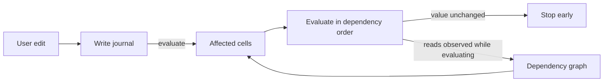

# Incremental recalculation

Incremental recalculation recomputes only the cells an edit affects, instead of the whole workbook. It is opt-in through `RecalcMode::Incremental`. The default stays full recalculation. Anything the incremental path does not model falls back to a full pass, so results always match full recalculation.

The engine records every write as it happens, observes what each formula reads while it evaluates, and uses the resulting dependency graph to recompute just the affected cells in dependency order. Recalculation stops early wherever a recomputed value turns out unchanged.



The design follows the same pattern as reactive UI libraries such as MobX, Vue, and signals. Dependencies come from watching real reads, and invalidation is pushed through the graph until an equality check stops it. The one difference is that recomputation is eager rather than lazy. Every cell of a spreadsheet is visible output, so deferring work never pays.

## How a pass works

`Model::evaluate` in incremental mode (`model/incremental.rs::evaluate_selective`):

1. Drain each worksheet's write log and derive the dirty set from it. A cell that stopped being a formula also drops its outgoing edges.
2. Add every cell that reads the clock or a random source. Those are always dirty.
3. Collect every cell reachable from the dirty set through cell, range, and input edges.
4. If the pass cannot be modeled (see fallbacks below), run a full pass instead.
5. Evaluate the affected cells in topological order. While each formula runs, a tracer records what it reads; when it finishes, those reads replace its edges in the graph.
6. If a recomputed cell's value, type, and link are unchanged, nothing downstream of it is recomputed.
7. Cells outside the affected set are served their stored values. Stored values are lossless (`FormulaValue::Empty` preserves blank results), so evaluation order never changes results.
8. Changes are accumulated for `Model::take_changed_cells`.

## Where things live

| File | Role |
|---|---|
| `recalc/journal.rs` | `Write` and `WriteLog`. Worksheet mutators push; `Model::evaluate` drains. Evaluation writes (storing a formula's result) are not journaled, because they are not edits. |
| `recalc/trace.rs` | `ReadSet` and `Input`. Records the cells, rectangles, and non-cell inputs one formula reads. A covering rectangle suppresses per-cell edges, so `SUM(A:A)` stays one edge. |
| `dependency_graph.rs` | The graph itself: edges keyed by cell, range, and input, a banded range index (`SheetRanges`), `replace_reads`, `reachable`, `topo_order`, `structural_edit`, and `RecalcMode`. |
| `model/incremental.rs` | The scheduler: `evaluate_selective`, the fallback decisions, the change cutoff, `take_changed_cells`, and the Verify assertions. This is the only module whose behavior depends on the mode. |
| `worksheet.rs` | The only producer of journal entries. `sheet_data` is written through mutators that push a `Write`. |
| `model/mod.rs` | `evaluate_cell` pushes a `ReadSet` frame, the `trace_cell`/`trace_rect`/`trace_input` helpers record into it, and a finished formula commits its reads to the graph. Tracing runs only in incremental mode. |

## Non-cell inputs

Volatility is an input, not a list of functions. `NOW` records `Input::Clock`, `RAND` records `Input::Random`, `SUBTOTAL` records row visibility, `ROW()` records its own position, and `OFFSET`/`INDIRECT` record their resolved targets plus `Input::Computed` so structural edits re-run them instead of shifting a stale snapshot. Readers of `Clock` and `Random` are always recalculated. Whether a cell must be recomputed and whether it belongs in the change report are separate facts, so a deterministic formula next to a volatile one is never reported by mistake.

## When the engine falls back to a full pass

- The graph is not ready: the first evaluation, or after sheet add/delete/rename, defined-name changes, locale, or timezone.
- Row or column moves. Inserts and deletes stay incremental; the graph shifts positions and edges in place.
- A dynamic array or spill anchor is among the affected cells. Spills need the full pass's two-phase ordering.
- The edit reaches more than half the workbook's formulas (with a floor of 1024, so small workbooks never fall back). This one is a performance choice, not a correctness one, and Verify disables it.

## Design rules

- Every write reaches the graph through the journal. Nothing else calls `mark_dirty`.
- Edges are the reads observed at evaluation time. There is no static analysis of formula text.
- A cell's value is a function of its inputs only. Modes choose which cells to evaluate, never what they evaluate to.
- Anything the model cannot represent falls back to full recalculation rather than approximating.

## Testing

```bash
# Full suite, default full recalculation
cargo test -p ironcalc_base --lib

# Full suite with incremental recalculation forced on
IRONCALC_RECALC=incremental cargo test -p ironcalc_base --lib

# Same suite plus a shadow full-recalculation pass that asserts both agree
IRONCALC_RECALC=verify cargo test -p ironcalc_base --features recalc_verify --lib

# Randomized comparison of both modes in lockstep, as run in CI
cargo test -p ironcalc_base --test fuzz_differential -- --nocapture

# Benchmark: cost of a single edit, incremental vs full
cargo test -p ironcalc_base bench_incremental --release -- --ignored --nocapture
```

`RecalcMode::Verify` (behind the `recalc_verify` feature) runs the incremental pass, asserts that the change report lists every change and nothing else, asserts every stored formula value equals a live re-evaluation, then runs a full pass on a snapshot and compares, so the check cannot repair the state it is checking.
