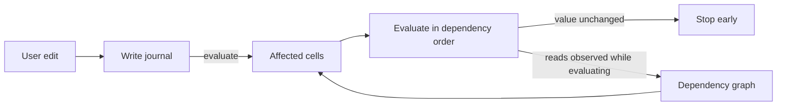

# Incremental recalculation

Incremental recalculation recomputes only the cells an edit affects, instead of the whole workbook. It is opt-in through `RecalcMode::Incremental`. The default stays full recalculation. Anything the incremental path does not model falls back to a full pass, so results always match full recalculation.

The engine records every write as it happens, observes what each formula reads while it evaluates, and uses the resulting dependency graph to recompute just the affected cells in dependency order. Recalculation stops early wherever a recomputed value turns out unchanged.



The design follows the same pattern as reactive UI libraries such as MobX, Vue, and signals. Dependencies come from watching real reads, and invalidation is pushed through the graph until an equality check stops it. The one difference is that recomputation is eager rather than lazy. Every cell of a spreadsheet is visible output, so deferring work never pays.

## How a pass works

`Model::evaluate` in incremental mode (`model/incremental.rs::evaluate_selective`):

1. Drain each worksheet's write log and derive the dirty set from it. A cell that stopped being a formula also drops its outgoing edges.
2. Add every cell that reads the clock or a random source, and every cell whose last result was not a function value (see below). Those are always dirty.
3. Collect every cell reachable from the dirty set through cell, range, and input edges.
4. If the pass cannot be modeled (see fallbacks below), run a full pass instead.
5. Evaluate the affected cells in topological order. While each formula runs, a tracer records what it reads; when it finishes, those reads replace its edges in the graph.
6. If a recomputed cell's value, type, and link are unchanged, nothing downstream of it is recomputed.
7. Cells outside the affected set are served their stored values. Stored values are lossless (`FormulaValue::Empty` preserves blank results), so evaluation order never changes results — for every cell whose stored value is a function value.
8. Changes are accumulated for `Model::take_changed_cells`.

## Where things live

| File | Role |
|---|---|
| `recalc/journal.rs` | `Write` and `WriteLog`. Worksheet mutators push; `Model::evaluate` drains. Evaluation writes (storing a formula's result) are not journaled, because they are not edits. |
| `recalc/trace.rs` | `ReadSet` and `Input`. Records the cells, rectangles, and non-cell inputs one formula reads. A covering rectangle suppresses per-cell edges, so `SUM(A:A)` stays one edge. |
| `dependency_graph.rs` | The graph itself: edges keyed by cell, range, and input, a banded range index (`SheetRanges`), `replace_reads`, `reachable`, `topo_order`, `structural_edit`, and `RecalcMode`. |
| `model/incremental.rs` | The scheduler: `evaluate_selective`, the fallback decisions, the change cutoff, `take_changed_cells`, and the Verify assertions. This is the only module whose behavior depends on the mode. |
| `worksheet.rs` | The only producer of journal entries. `sheet_data` is written through mutators that push a `Write`. |
| `model/mod.rs` | `evaluate_cell` pushes a `ReadSet` frame, the `trace_cell`/`trace_rect`/`trace_input` helpers record into it, and a finished formula commits its reads to the graph. Tracing runs only in incremental mode. |

## Cells that never serve a stored value

Serving a stored value is only sound when that value is a function of the cell's inputs. Two kinds of cell fail that test, and both are found by reading the state the last pass left rather than by matching a shape:

- **A cell on a dependency cycle and anything downstream of one.** A cycle has no fixed point: what its members hold is an artifact of which member the walk entered first, and a reader of one holds whatever it saw mid-cycle (`COUNT` swallows a `#CIRC!` into a number). Full re-derives all of it from scratch on every pass, so incremental seeds those cells dirty on every pass and recomputes them and their readers. The set is the cells `topo_order` cannot place (those on a cycle plus everything after one), rebuilt over the whole graph after each full pass and over the cone after each incremental one.

  The set used to carry a second half: every cell whose stored value was `#CIRC!` — the evaluator's own report that it re-entered itself — kept in case some read that closed a loop left no edge behind. There is no such read. `evaluate_cell` records the read before any early return, including the one the incremental scope answers from the store, and a formula commits its reads on both exits, so every cross-cell read that can re-enter is an edge. The one edge the graph drops on purpose is a cell's read of *itself* (`replace_reads`: `if p != dependent`), and that is exactly what the witness half added: self-references, and the `#CIRC!` that propagates out of one. A self-cycle has a single entry point, so what it holds *is* a function of the cell's inputs, and every non-self read it makes is still an edge, so anything that could move its value dirties it the ordinary way. The half is gone: it never changed a result, and while it stood it left every self-referential cell permanently dirty — and, for one inside an array footprint, every later pass full.
- **A reader of a blocked spill anchor.** The anchor stores `#SPILL!` but hands a same-pass reader the live array's top-left value, so a reader recomputed against the stored error gets something a full pass never produces. Their stored values are served — they are what full computed — but recomputing one takes a full pass, which is the only pass that evaluates the anchor live, so a cone that reaches one falls back.

`RecalcMode::Verify`'s stored-vs-live check skips exactly these cells, because they are exactly the cells a one-cell scratch frame reading the store cannot reproduce. The two lists are the same list.

Cycle cells are recomputed on every pass but are not *reported* on every pass: the delta still names only the cells whose observable state moved. Full's `#CIRC!` placement can shift with any edit, and when it does the recompute sees it and the delta says so.

## Array footprints are edges

An array anchor writes its spill members as evaluation writes, not edits, so nothing journals them. Reading a member is therefore recorded as a read of the anchor: the array index maps every footprint position to its anchor, and `evaluate_cell` records the anchor's position along with the position actually read — including a position whose spill cell a structural edit dropped, whose index entry survives until the next full pass refills it, and including reads that the incremental scope answers from the store. Without that edge a cycle running through an array footprint is invisible to the graph, and the cells around it look like ordinary results.

The index holds each anchor and each spill cell, not each anchor's declared rectangle. A CSE anchor owns a rectangle it refills whether or not the cells are there, but a *ghost* member — a declared position with no spill cell — only exists between the write that created it and the anchor's next evaluation, and that write dirties the anchor. The anchor is in the index, so the cone holding it goes full, and that is the pass that refills the rectangle. Indexing the rectangle restated what the anchor's own entry already said.

## Non-cell inputs

Volatility is an input, not a list of functions. `NOW` records `Input::Clock`, `RAND` records `Input::Random`, `SUBTOTAL` records row visibility, `ROW()` records its own position, and `OFFSET`/`INDIRECT` record their resolved targets plus `Input::Computed` so structural edits re-run them instead of shifting a stale snapshot. Readers of `Clock` and `Random` are always recalculated. Whether a cell must be recomputed and whether it belongs in the change report are separate facts, so a deterministic formula next to a volatile one is never reported by mistake.

## When the engine falls back to a full pass

- The graph is not ready: the first evaluation, or after sheet add/delete/rename, defined-name changes, locale, or timezone.
- Row or column moves. Inserts and deletes stay incremental; the graph shifts positions and edges in place.
- A dynamic array or spill anchor is among the affected cells. Spills need the full pass's two-phase ordering.
- The edit reaches more than half the workbook's formulas (with a floor of 1024, so small workbooks never fall back). This one is a performance choice, not a correctness one, and Verify disables it.
- The pass reported `#CIRC!` for a cycle the graph did not already contain. The closing edge is only observed while the pass runs, so the cone was ordered without it and the error would land on a different cell than the full pass picks. A cycle the graph already knows about is walked by position instead, in the full pass's own two phases: array formulas first, then everything else, each row-major. That is the order the full pass walks in, and the cone contains every cell full could reach a cycle member through, because such a cell reads one transitively and so is a reader of an always-dirty cell. Since a known cycle is in every cone, this is also the walk a cycle *closing* on this pass gets when another cycle is already open — which is why phase 1 stays: the pass an anchor first falls inside a cycle, the anchor is not yet a seed, and only phase 1 makes full enter the cycle where it does.
- The cone reaches a reader of a blocked spill anchor.
- The previous pass left convergence debt (see below).

## Convergence debt

A full pass is not a fixed point. Its phase 1 spills arrays and its phase 2 evaluates the rest, so a formula can read a spill member before the anchor refills it, and a cycle that runs through an array member resolves against that member's stored value. Full recalculation heals those readers on its *next* pass, because it rescans everything unconditionally.

Incremental has to match that pass for pass. So a full pass run from the incremental scheduler compares the array footprint's values across the pass: if a footprint cell moved and something read it (or a cycle resolved through the array), the pass left debt, and the graph records it so the next pass is full too. The debt clears itself, because the healing pass moves nothing and the pass after it is selective again. A workbook with no arrays never records debt, so plain editing is unaffected.

## Design rules

- Every write reaches the graph through the journal. Nothing else calls `mark_dirty`.
- Edges are the reads observed at evaluation time. There is no static analysis of formula text.
- A cell's value is a function of its inputs only. Modes choose which cells to evaluate, never what they evaluate to.
- Anything the model cannot represent falls back to full recalculation rather than approximating.

## Testing

```bash
# Full suite, default full recalculation
cargo test -p ironcalc_base --lib

# Full suite with incremental recalculation forced on
IRONCALC_RECALC=incremental cargo test -p ironcalc_base --lib

# Same suite plus a shadow full-recalculation pass that asserts both agree
IRONCALC_RECALC=verify cargo test -p ironcalc_base --features recalc_verify --lib

# Randomized comparison of both modes in lockstep, as run in CI
cargo test -p ironcalc_base --test fuzz_differential -- --nocapture

# Benchmark: cost of a single edit, incremental vs full
cargo test -p ironcalc_base bench_incremental --release -- --ignored --nocapture
```

`RecalcMode::Verify` (behind the `recalc_verify` feature) runs the incremental pass, asserts that the change report lists every change and nothing else, asserts every stored formula value equals a live re-evaluation, then runs a full pass on a snapshot and compares, so the check cannot repair the state it is checking.

## Test discipline

Every test in this engine's suite must pin one named invariant: the name says what breaks, a doc comment
says why it matters when that is not obvious, and the shape is the minimal one that fails when the
mechanism is wrong. Before adding a test, check whether an existing one already dies for the same
mutation; before deleting or merging tests, re-apply the relevant mutants (see the nightly-recalc-audit
workflow) and confirm nothing that used to die now survives. Redundancy is measured by kill-power, not by
reading similarity.

Where a test goes follows from that. The default is the lib suite: it is what
`IRONCALC_RECALC=incremental`/`verify` re-run under a different strategy and what the nightly
`cargo mutants` job executes, so a test outside it is a test those two oracles never see. Each
`base/tests/*.rs` file is also its own compile-and-link, so a new one costs build time on every
`cargo test`. Only three things earn a place there:

- `fuzz_differential.rs` and `common/`, the lockstep harness and generator.
- `fuzz_covfuzz_regressions.rs`, minimized fuzz artifacts replayed through that harness — one shape
  per kill class, each doc comment naming the mutant it dies to.
- `recalc_cost.rs`, the one wall-clock invariant, kept out of the lib suite so the mutation job does
  not pay for a 32k-cell workbook once per mutant.
