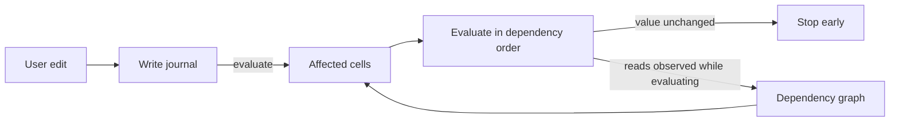

# Incremental recalculation

Incremental recalculation recomputes only the cells an edit affects, instead of the whole workbook. It is opt-in through `RecalcMode::Incremental`. The default stays full recalculation. Anything the incremental path does not model falls back to a full pass, so results always match full recalculation.

The engine records every write as it happens, observes what each formula reads while it evaluates, and uses the resulting dependency graph to recompute just the affected cells in dependency order. Recalculation stops early wherever a recomputed value turns out unchanged.



The design follows the same pattern as reactive UI libraries such as MobX, Vue, and signals. Dependencies come from watching real reads, and invalidation is pushed through the graph until an equality check stops it. The one difference is that recomputation is eager rather than lazy. Every cell of a spreadsheet is visible output, so deferring work never pays.

## How a pass works

`Model::evaluate` in incremental mode (`model/incremental.rs::evaluate_selective`):

1. Drain each worksheet's write log and derive the dirty set from it. A cell that stopped being a formula also drops its outgoing edges.
2. Add every cell that reads the clock or a random source, and every cell whose last result was not a function value (see below). Those are always dirty.
3. Collect every cell reachable from the dirty set through cell, range, and input edges.
4. If the pass cannot be modeled (see fallbacks below), run a full pass instead.
5. Evaluate the affected cells in topological order. While each formula runs, a tracer records what it reads; when it finishes, those reads replace its edges in the graph.
6. If a recomputed cell's value, type, and link are unchanged, nothing downstream of it is recomputed.
7. Cells outside the affected set are served their stored values. A formula whose live result is an empty cell coerces to `Number(0.0)` at the result boundary, before the value is stored — `FormulaValue` has no blank variant. So the stored value is exactly what a live read of that cell returns. That coercion is what makes the full pass itself order-independent (a same-pass reader sees the stored `0` whether it ran before or after the cell it reads), and it is the same reason serving a stored value never changes a result here — for every cell whose stored value is a function value.
8. Changes are accumulated for `Model::take_changed_cells`.

## Where things live

| File | Role |
|---|---|
| `recalc/journal.rs` | `Write` and `WriteLog`. Worksheet mutators push; `Model::evaluate` drains. Evaluation writes (storing a formula's result) are not journaled, because they are not edits. |
| `recalc/trace.rs` | `ReadSet` and `Input`. Records the cells, rectangles, and non-cell inputs one formula reads. A covering rectangle suppresses per-cell edges and widens the per-line and per-cell inputs read beneath it, so `SUM(A:A)` stays one edge and `SUBTOTAL(103,A:A)` two. |
| `dependency_graph.rs` | The graph itself: edges keyed by cell, range, and input, a banded range index (`SheetRanges`), `replace_reads`, `reachable`, `topo_order`, `structural_edit`, and `RecalcMode`. A structural edit shifts every index through `Shift`, applied field by field in `shift`, which destructures the struct so a new index cannot skip it. Also `SheetLayout`, the sheet numbering the stored positions are expressed in — see "Sheet numbering" below. |
| `model/incremental.rs` | The scheduler: `evaluate_selective`, `cone_is_plain` (the one predicate that decides whether a pass may be selective), `evaluate_full_to_fixed_point` (the settling loop every full pass runs through, in every mode), and the frontier and whole-cone recomputes. The *scheduling* decision lives here and only here; the evaluator's own mode branches are the `tracing()` gates in `model/mod.rs` and the dispatch in `Model::evaluate`. |
| `model/changed_cells.rs` | What counts as an observable change (`ChangeKey`), and the delta `take_changed_cells` reports. |
| `model/array_index.rs` | `array_footprint` and the walks that maintain the array/spill index and the formula count between full passes. |
| `model/unstable_cells.rs` | Rebuilds one of the two sets of cells whose stored value may not be served (below): the readers of blocked spill anchors, which is the set that needs stored cell state the graph cannot see. The other set, the cycle cone, is derived from edges alone, so the graph computes it itself (`cycle_cone`) and each scheduler installs it after its pass. |
| `model/cse_guard.rs` | The CSE member guard flag and the only scope that may suspend it. |
| `model/verify.rs` | The `RecalcMode::Verify` oracle. Compiled only under the `recalc_verify` feature. |
| `worksheet.rs` | The only producer of journal entries. `sheet_data` is written through mutators that push a `Write`. |
| `model/mod.rs` | `evaluate_cell` pushes a `ReadSet` frame, the `trace_cell`/`trace_rect`/`trace_input` helpers record into it, and a finished formula commits its reads to the graph. Tracing runs only in incremental mode. Also `evaluate_full`, whose two-phase order the incremental path must reproduce: `is_phase_one_cell` and `cells_in_order` are that order's one definition. |

## Cells that never serve a stored value

Serving a stored value is only sound when that value is a function of the cell's inputs. Two kinds of cell fail that test, and both are found by reading the state the last pass left rather than by matching a shape:

- **A cell on a dependency cycle and anything downstream of one.** A cycle has no fixed point: what its members hold is an artifact of which member the walk entered first, and a reader of one holds whatever it saw mid-cycle (`COUNT` swallows a `#CIRC!` into a number). Full re-derives all of it from scratch on every pass, so incremental seeds those cells dirty on every pass and recomputes them and their readers. The set is the cells `topo_order` cannot place (those on a cycle plus everything after one), rebuilt over the whole graph after each full pass and over the cone after each incremental one.

  The set used to carry a second half: every cell whose stored value was `#CIRC!` — the evaluator's own report that it re-entered itself — kept in case some read that closed a loop left no edge behind. There is no such read. `evaluate_cell` records the read before any early return, including the one the incremental scope answers from the store, and a formula commits its reads on both exits, so every cross-cell read that can re-enter is an edge. The one edge the graph drops on purpose is a cell's read of *itself* (`replace_reads`: `if p != dependent`), and that is exactly what the witness half added: self-references, and the `#CIRC!` that propagates out of one. A self-cycle has a single entry point, so what it holds *is* a function of the cell's inputs, and every non-self read it makes is still an edge, so anything that could move its value dirties it the ordinary way. The half is gone: it never changed a result, and while it stood it left every self-referential cell permanently dirty — and, for one inside an array footprint, every later pass full.
- **A reader of a blocked spill anchor.** The anchor stores `#SPILL!` but hands a same-pass reader the live array's top-left value, so a reader recomputed against the stored error gets something a full pass never produces. Their stored values are served — they are what full computed — but recomputing one takes a full pass, which is the only pass that evaluates the anchor live, so a cone that reaches one falls back.

`RecalcMode::Verify`'s stored-vs-live check skips exactly these cells, because they are exactly the cells a one-cell scratch frame reading the store cannot reproduce. The two lists are the same list.

Cycle cells are recomputed on every pass but are not *reported* on every pass: the delta still names only the cells whose observable state moved. Full's `#CIRC!` placement can shift with any edit, and when it does the recompute sees it and the delta says so.

## Array footprints are edges

An array anchor writes its spill members as evaluation writes, not edits, so nothing journals them. Reading a member is therefore recorded as a read of the anchor: the array index maps every footprint position to its anchor, and `evaluate_cell` records the anchor's position along with the position actually read — including a position whose spill cell a structural edit dropped, whose index entry survives until the next full pass refills it, and including reads that the incremental scope answers from the store. Without that edge a cycle running through an array footprint is invisible to the graph, and the cells around it look like ordinary results.

The index holds each anchor and each spill cell, not each anchor's declared rectangle. A CSE anchor owns a rectangle it refills whether or not the cells are there, but a *ghost* member — a declared position with no spill cell — only exists between the write that created it and the anchor's next evaluation, and that write dirties the anchor. The anchor is in the index, so the cone holding it goes full, and that is the pass that refills the rectangle. Indexing the rectangle restated what the anchor's own entry already said.

## Non-cell inputs

Volatility is an input, not a list of functions. `NOW` records `Input::Clock`, `RAND` records `Input::Random`, `SUBTOTAL` records row visibility, `ROW()` records its own position, and `OFFSET`/`INDIRECT` record their resolved targets plus `Input::Computed` so structural edits re-run them instead of shifting a stale snapshot. Readers of `Clock` and `Random` are always recalculated. Whether a cell must be recomputed and whether it belongs in the change report are separate facts, so a deterministic formula next to a volatile one is never reported by mistake.

## When a pass is allowed to be selective

The default is the full pass. A pass is selective only when the engine can say positively that it may be, which is one predicate over the cone — `evaluate_selective`'s `cone_is_plain`. The cone is **plain** when:

- **P1** no cone member is in the array index. Spilling needs the full pass's two-phase ordering, and a spill member's value is its anchor's output rather than its own. This is the index rather than the cells, deliberately: it is what sees a *ghost* member, a declared footprint position whose spill cell a structural edit dropped, where the live cell no longer says "array" but the anchor still owns the position. It cannot miss a live one either — `array_footprint` is the single definition of what goes in, and every array cell reaches it: a user-written one through the journal drain, an evaluation-written one through the `wrote_array_cells` redo below, a moved one through `shift`. A dynamic anchor whose last result was a plain 1×1 scalar is not in the index and is plain, because `=LET(..)`, a called `LAMBDA` and `=INDEX(..)` are everyday formulas that must not cost a full pass.
- **P2** no cone member is a reader of a blocked spill anchor. Its stored value came from the live array's top-left, not from the anchor's stored `#SPILL!`, so recomputing it here would read the error instead. Only the full pass evaluates the anchor live.

This is a whitelist on purpose. It used to be a blacklist of hazards, and a hazard nobody had thought of was a wrong value; inverted, a case nobody thought of fails the predicate and costs a full pass. A missed case degrades to slow rather than to wrong.

Three clauses the predicate deliberately does **not** have, each because it would cost a case incremental wins today and buys no correctness:

- *No cone member in `never_served`.* A known cycle is seeded dirty on every pass, so it is in every cone, so this clause would send every workbook containing one cycle to a full pass forever (the `pathological-cycle` bench row is 97× at a cone of 23; the clause makes it 1×). A cone with a cycle in it is handled by walking it in Full's own two phases instead — see the `#CIRC!` bullet below.
- *No structural op this drain.* Row and column *moves* already force the graph to rebuild, which the readiness gate catches. Inserts and deletes shift the indices in place and stay selective by design; the clause would throw that away (`structural: insert_rows` is 4.6×).
- *No volatile beyond the seeded always-dirty.* There is nothing to exclude: volatility is a recorded `Input`, every reader of one is in `always_dirty_cells`, and the pass seeds all of them before taking the cone.

Four things outside the cone predicate also send a pass to full:

- The graph is not ready: the first evaluation, or after sheet add/delete/rename, defined-name changes, locale, or timezone. Row or column moves land here too; inserts and deletes do not. For the sheet edits this is no longer only a convention — see "Sheet numbering" below.
- The cone reaches more than half the workbook's formulas (with a floor of 1024, so small workbooks never fall back). This one is a performance choice, not a correctness one — which is why it is checked separately from plainness and why Verify disables it and not plainness.
- The pass reported `#CIRC!` for a cycle the graph did not already contain. The closing edge is only observed while the pass runs, so the cone was ordered without it and the error would land on a different cell than the full pass picks. A cycle the graph already knows about is walked by position instead, in the full pass's own two phases: array formulas first, then everything else, each row-major. That is the order the full pass walks in, and the cone contains every cell full could reach a cycle member through, because such a cell reads one transitively and so is a reader of an always-dirty cell. Since a known cycle is in every cone, this is also the walk a cycle *closing* on this pass gets when another cycle is already open — which is why phase 1 stays: the pass an anchor first falls inside a cycle, the anchor is not yet a seed, and only phase 1 makes full enter the cycle where it does.
- The pass itself wrote into an array footprint: a spill landed, a CSE range filled, or an anchor stored `#SPILL!`. This is the one hazard no pre-pass predicate can rule out, and it is the reason the last of the old blacklist survives the inversion. P1 admits a dynamic anchor whose last result was a plain 1×1 scalar; whether *this* pass's result is still 1×1 is not a property of any stored state, it is what the pass produces. An anchor that grows spills members the selective pass has no ordering for, so the pass is redone as full and `collect_array_cells` rebuilds the index exactly rather than patching it.

## Sheet numbering

A `Position`'s sheet component is an *index* into `workbook.worksheets`. Adding, deleting, duplicating or moving a sheet renumbers the sheets after it, so every position the graph stores — edges, precedents, array anchors, `never_served`, the dirty set — moves onto a different sheet at once. Nothing about the stale coordinate looks wrong: the old index still names a live sheet, so a walk over the stale graph returns confident wrong answers rather than failing.

What stops that is `reset_parsed_structures` calling `invalidate_graph`, which every sheet edit routes through. That is a convention, and `SheetLayout` is the check that it held. The graph records the **sheet-id sequence** it last ran under; `Model::evaluate` compares it against the workbook's current one before dispatching a pass. A sheet id is allocated once at creation and never reassigned, so the sequence changes under exactly the edits that renumber: an insert or delete resizes it, a move permutes it, and a rename — which changes formula text, not numbering — leaves it alone and is covered by the reparse's own invalidation.

The layout is *derived* rather than counted, which is the whole point of the shape. There is no generation to bump, so there is no bump for a new sheet-CRUD path to forget: such a path is checked the moment it lands, without its author knowing this mechanism exists. A mismatch against a graph that still holds edges is a `debug_assert` failure — the corruption was silent before, and the edit that skipped the invalidation is the only place worth reporting — and in release builds the graph is downgraded to `MustRebuild`, so a shipped workbook gets the correct full pass the missing `invalidate_graph` should have asked for instead of being served stale edges.

This detects staleness; it does not make it unrepresentable. The stronger move — keying positions by stable sheet ids so renumbering stops existing — was assessed and deferred; see Follow-ups.

**Kill-proof.** The mutant is `delete_sheet` reparsing but not invalidating: the sheet arm of I8.1 with the convention removed and nothing else touched. Before this mechanism it survived the entire lib suite in every mode — 2342 passed, 0 failed under `IRONCALC_RECALC=incremental`. The only thing that caught it was the differential fuzzer, on seed 1, minimized to six operations (two `AddSheet`s, a write to the third sheet, evaluate, `DeleteSheet`, evaluate) and surfacing as a missing delta entry for a cell on a sheet that no longer exists. With the mechanism it dies deterministically in thirteen tests across `test_sheets`, `test_add_delete_sheets`, `test_move_sheet`, `test_defined_names`, `test_duplicate_sheet` and `test_sheets_undo_redo`, each reporting the edit that skipped the invalidation rather than a divergence at whatever cell happened to read the stale edge first. That is the clause moving out of the **oracle** column: not a new witness, a mechanism that makes hunting for one unnecessary.

## One `evaluate` settles

A single two-phase pass is not a fixed point. Phase 1 spills the arrays and phase 2 evaluates the rest, but `evaluate_cell` recurses, so a phase-2 formula can be pulled in early and read a footprint position before its anchor refills it — after a row move, a delete, or a first spill. That reader then holds a value the same inputs would never produce again, and only a *further* whole-workbook pass repairs it.

`evaluate` runs that further pass itself. `evaluate_full_to_fixed_point` repeats the two-phase pass while the pass it just ran changed the array footprint, so what `evaluate` returns is the settled state rather than the first approximation of it. Excel settles fully per recalculation; this is the same contract.

**The condition is footprint *membership*, not footprint values** (`settled_footprint`). What strands a reader is a position changing hands — appearing, vanishing, or moving to another anchor. A reader of a position that stayed a live spill member cannot have been served a pre-write value, because `evaluate_cell`'s `SpillCell` arm evaluates the anchor before returning the member. Comparing values instead is both too weak and too strong: too weak, because the pass that *first* indexes an array has no previous value for any of its positions and would call itself settled on the strength of having compared nothing — the state every workbook loaded from bytes is in; too strong, because `RANDARRAY` re-rolls every pass by definition and would be asked to converge to a fixed point it does not have, spinning to the bound on every evaluate. Membership answers both: a first index is a membership change, a re-roll is not.

There is no test for whether anything *read* the moved position either. Edges exist only in the tracing modes, so a reader test would settle `Incremental` and leave `Full` one healing window behind, which is the one divergence this engine may not have. An extra pass over a footprint nothing read recomputes the same values and stops.

The comparison reads the array index, so the index is rebuilt after a full pass in *every* mode — it is settling machinery, not edge machinery. **A pass that evaluated no array cell and was handed an empty index skips that rebuild**, which is what keeps a workbook with no arrays from paying for any of this: the rebuild is the only whole-workbook walk the settling machinery costs, and with the index empty the comparison is two empty sets. It is sound because a full pass walks every stored cell — if none of them was a `Cell::ArrayFormula` or a `Cell::SpillCell`, the correct index is empty, which is what it already is. Both halves of the gate are load-bearing: the *evaluated* half because a workbook that arrives whole has arrays in its cells and nothing in its index, and nothing else would ever build it (`a_loaded_workbook_settles_on_its_first_evaluate`); the *index* half because the journal drain only ever adds to the index, so the pass after the last array is deleted is the one walk that clears what it left (`deleting_the_last_array_clears_the_index`). `evaluated_array_cells` is set by the evaluator itself, in both modes, and never derived from tracing or the graph — a mode-dependent gate would give the two modes different fixed points.

Termination: iteration *k*+1 runs the same deterministic pass over iteration *k*'s output and stops as soon as membership comes back unchanged. Membership is a function of the evaluated workbook, so it is stable one pass after the anchors that determine it are; each re-run resolves one layer of anchor-reads-anchor, and the cascade is bounded by the depth of that chain. Every shape found so far settles in two. `MAX_SETTLING_PASSES` (4) is the belt: past it a debug build asserts loudly and a release build stops, identically in both modes, so the modes still agree.

This replaces a *convergence-debt* mechanism, which reproduced the unsettled window instead of closing it: a full pass that moved a footprint under a recorded reader set a flag on the graph, and the next pass was forced full to heal it, so `Incremental` matched `Full`'s accident pass for pass. Both sides of that agreement are gone; see [Intentional divergences](#intentional-divergences).

## Intentional divergences

Two places where this engine deliberately does not reproduce what the pre-engine `Model::evaluate` did. Everything else is bug-for-bug identical, and a difference that is not in this list is a defect.

- **A blank formula result is `0`, not blank.** A formula whose live result is an empty cell coerces to `Number(0.0)` at the result boundary, before the value is stored. The baseline was *order-dependent*: a same-pass reader that ran before the blank-returning formula saw `Empty`, one that ran after saw the stored `0`. Excel caches a blank result as `<v>0</v>`, so `0` is both the Excel answer and the one that makes the full pass order-independent — which is what lets a stored value be served at all (I3.6, `stored_empty_formula_is_live_zero`).
- **One `evaluate` settles.** Where the baseline needed a second `evaluate` to heal a reader that had read an array footprint before the anchor refilled it, one `evaluate` now returns the healed value. The observable sequences that differ are exactly the previously-unsettled healing windows, and only within them: for a workbook where the baseline's pass *N* left a footprint moving under a reader, this engine's pass *N* holds what the baseline's pass *N*+1 held. Values are strictly more converged, never less — the extra work is the baseline's own next pass, run early. Outside such a window nothing changes, and a workbook with no arrays has no such window at all. Excel settles per recalculation, so this is Excel parity (`one_evaluate_settles_a_footprint_moved_under_a_reader`).

  Both recalc modes settle, so this is not an `Incremental` ≠ `Full` divergence and the differential fuzzer — which compares a `Full` model against an `Incremental` model — is unaffected by it. One lib test pinned the unsettled intermediate directly and was rewritten as the witness above; no other test's expectations moved.

## Design rules

- No *write* reaches the graph except through the journal. `model/mod.rs` dirties the graph only from `drain_write_journal`, and the mutation paths (`actions.rs`, `undo_redo.rs`, `clipboard.rs`, `common.rs`) never touch it at all — both halves are held by the `graph_is_only_notified_by_the_journal` gate. The scheduler's own `mark_dirty` calls are not writes: they seed the pass with the always-dirty cells, the never-served cells, and the array anchors a full pass first observed, none of which any edit reports.
- Edges are the reads observed at evaluation time. There is no static analysis of formula text.
- A cell's value is a function of its inputs only. Modes choose which cells to evaluate, never what they evaluate to.
- Anything the model cannot represent falls back to full recalculation rather than approximating.

## Testing

```bash
# Full suite, default full recalculation
cargo test -p ironcalc_base --lib

# Full suite with incremental recalculation forced on
IRONCALC_RECALC=incremental cargo test -p ironcalc_base --lib

# Same suite plus a shadow full-recalculation pass that asserts both agree
IRONCALC_RECALC=verify cargo test -p ironcalc_base --features recalc_verify --lib

# Randomized comparison of both modes in lockstep, as run in CI
cargo test -p ironcalc_base --test fuzz_differential -- --nocapture

# Benchmark: cost of a single edit, incremental vs full
cargo test -p ironcalc_base bench_incremental --release -- --ignored --nocapture
```

`RecalcMode::Verify` (behind the `recalc_verify` feature) runs the incremental pass, asserts that the change report lists every change and nothing else, asserts every stored formula value equals a live re-evaluation, then runs a full pass on a snapshot and compares, so the check cannot repair the state it is checking.

## Invariants and their witnesses

The suite here is large next to the engine, and the only thing that makes that defensible is that every test is the minimal witness of a named clause. This section is the map: eight invariants, the clauses each decomposes into, what enforces each clause, and — where the answer is "a test" — which test.

Four things can enforce a clause, and only two of them owe a test:

| | What it means | Owes a test |
|---|---|---|
| **construction** | The type system, a privacy boundary, or the shape of the code makes the violation unrepresentable. | No. A test here asserts what the compiler already says. |
| **gate** | A grep-gate in `test/test_recalc_invariants.rs`, or a `clippy.toml` `disallowed-methods` entry. | No — the gate is the witness. |
| **test** | Nothing but a test sees it. | Yes: one witness, named below. |
| **oracle** | `RecalcMode::Verify` and the differential fuzzer find it over shapes nobody enumerated. | Only a deterministic fast gate, and only where it kills something no kept test kills. |

`base/tests/common/` — the generator, the lockstep harness, the minimizer — is the mechanism behind the **oracle** column. It is the largest file in the suite and it is tooling, not tests. It plants six SUMIFS shapes, eleven OFFSET/INDIRECT shapes, seven SUBTOTAL shapes and a volatile zoo on every run, which is why one deterministic witness per clause is enough here and a second shape of the same clause is not.

### I1 — every evaluation read records an edge or an Input

| Clause | Enforcement | Witness |
|---|---|---|
| I1.1 A cell read is recorded before any early return — the scope gate that answers from the store, and the `#CIRC!` return | construction (`trace_cell` is the first statement of `evaluate_cell`) | — |
| I1.2 A function implementation reaches cell state only through the recording accessors | construction (`functions/` runs on `EvalCtx`, a newtype over `&mut Model` with a private inner reference; it has no `workbook` field and no untraced getter, so the bypass does not compile) | — |
| I1.3 A rectangle is recorded at its declared extent, not the extent the walk visited: `SUM(B:D)` clips its per-cell walk to the used range, so only the rect connects a write outside it | test | `multi_column_range_edits_propagate` (three columns wide, so it kills both a >1 and a >=3 rect drop; the old two-column shape pinned only the first); the run-time-widened case is `incremental_sumifs_reads_resized_criteria`; the `#` operator's edge on a not-yet-written anchor is `spill_hash_of_empty_anchor_sees_later_formula` |
| I1.4 Each volatile or environment function records its `Input` | test, one per variant | Random: `volatile_rerolls_across_repeated_incremental_passes`. Clock: `clock_volatile_is_reported_on_every_incremental_pass`. OwnCoord: `incremental_argless_row_updates_after_insert` |
| I1.5 Reading a cell's formula text or formula-ness records `FormulaText` — three independent call sites | construction (all three ways in — `EvalCtx::get_cell_formula`, `get_english_cell_formula`, `formula_index_at` — record it themselves) | — |
| I1.6 Reading row visibility records `RowHidden`, keyed to the rows read: the one row for a lone read, the rect's rows for a read beneath a recorded rect (I1.11) | *that* it records: construction (`EvalCtx::row_hidden` is the only way in and traces first). *Which rows* it keys on: test | `subtotal_sees_hidden_row_it_scans_not_own_row` — hiding the scanned row re-runs it, hiding its own row, outside the rect, does not |
| I1.7 Reading a defined name records `Name` | test | `name_reader_redirty_on_insert` |
| I1.8 A reference-returning function's resolved target becomes an edge, at the extent it resolved to | test; the extent is one per call site | `offset_target_change_without_static_edge`; the extent is `offset_records_its_resolved_extent_not_the_walk` and `indirect_records_its_resolved_extent_not_the_walk` (I1.3's clipping rule, reached through a computed extent) |
| I1.9 Reading an array-footprint position records an edge on its anchor, taken from the array index and recorded ahead of the scope gate | test | `cse_footprint_cycle_stored_value_diverges_from_a_live_reeval` (dies only under `recalc_verify`) |
| I1.10 A formula commits its reads on both exits | construction | — |

Two reads in `functions/` used to bypass the recording accessors — the
financial whole-column clip and `SHEET(a_defined_name)`. Both now go through
`EvalCtx::sheet_dimension` and `EvalCtx::defined_name`, so I1.2 has no
exceptions. Neither was ever a wrong answer, and neither has a witness,
because neither *can* be one:

- the clip's declared rect is recorded whole when the `RangeKind` node is
  evaluated, before any function clips its walk (I1.3), so the rect already
  covers every write that could move the result. Delete that `trace_rect` and
  a whole-column `NPV` does go stale — which is I1.3's witness, not a new one.
- every defined-name edit calls `invalidate_graph`, so a name reader is never
  served from the store at all.

A test asserting either would pass before the fix as readily as after. They
are routed for one reason only: so that "every accessor on `EvalCtx` records"
has no exceptions to remember.

### I2 — every user mutation journals; the pause is guard-scoped

| Clause | Enforcement | Witness |
|---|---|---|
| I2.1 A no-op write and a style-only materialization are not edits; a write that changes state is one even when the formula index does not move | test | `style_on_blank_cell_does_not_enter_the_delta`, `blocked_spill_reset_on_insert_below_matches_full` |
| I2.2 Nothing outside the journal drain dirties the graph | gate | `graph_is_only_notified_by_the_journal` |
| I2.3 Recording is paused only through a `#[must_use]` Drop guard | construction (`set_recording` is private to `mod journal`) | — |
| I2.4 A displacement journals a value write substituted for the suppressed formula write | test | `incremental_handles_row_delete` |
| I2.5 A batch's pre-batch formula-ness is read off its first entry, so the journal-maintained formula count agrees with a recount | test | `journal_accounts_a_batch_against_its_pre_batch_state` |
| I2.6 A cell that stops being a formula loses its outgoing edges, through every write API | test | `journal_value_over_formula_drops_edges` |
| I2.7 Overwriting a cell re-dirties the readers of its formula text | test | `formulatext_sees_value_overwrite_of_its_argument`, `isformula_sees_value_overwrite_of_its_argument` (they used to double as I1.5's witnesses; I1.5 is constructional now, this clause is what keeps them) |
| I2.8 A link write and a link removal journal, from each producer, including a link stranded at a position with no cell | test, one per producer | `cell_link_write_is_reported_in_the_delta`, `range_clear_reports_a_stranded_link_removal` |
| I2.9 A hidden-flag write dirties the readers of that line | test | `incremental_subtotal_sees_hidden_row` (it used to double as I1.6's witness; the recording half is constructional now, this clause is what keeps it) |
| I2.10 A rejected write journals nothing | test | `journal_rejected_write_logs_nothing` |
| I2.11 Undo's writes journal, including through a paused evaluation | test | `incremental_undo_under_pause_stays_correct` |

### I3 — a stored value is served only where it is a function of that cell's inputs

| Clause | Enforcement | Witness |
|---|---|---|
| I3.1 Cells on a cycle and everything downstream are seeded dirty every pass | test + oracle | `covfuzz_count_offset_cycle_lost_after_number_overwrite` |
| I3.2 That set is rebuilt over the whole graph after a full pass, so a cycle no cone would seed is still known | test | the same shape (it dies to both mutants) |
| I3.3 A blocked (`#SPILL!`) anchor stays in the array index | test | `a_blocked_anchors_reader_is_recomputed_only_by_a_full_pass` |
| I3.4 The blocked-reader set is rebuilt on every full pass | test | the same |
| I3.5 Verify's stored-vs-live skip list is the never-served list | construction | — |
| I3.6 A blank formula result is stored as the 0 a live re-evaluation produces | test + oracle | `stored_empty_formula_is_live_zero` |

### I4 — the selective pass produces Full's result, pass for pass

| Clause | Enforcement | Witness |
|---|---|---|
| I4.1 The cone is closed under cell, range and input dependents; the banded range index answers the point query exactly and prunes what it drops | test + oracle | `range_index_matches_brute_force`, `removing_last_dependent_prunes_the_index` |
| I4.2 The acyclic cone is ordered by edges, not position | test | `acyclic_cone_orders_a_scalar_anchor_by_edges_not_position` (the anchor sits *below* its reader, so a positional walk gets it wrong) |
| I4.3 The known-cycle cone is walked in Full's own two phases | test | `new_cycle_around_an_anchor_places_circ_like_full_phase_one` |
| I4.4 Each cone cell is evaluated at most once per pass | test | `incremental_does_not_re_evaluate_a_mid_cycle_cell` |
| I4.5 The change key is `(type, number bits, link)`, and the cutoff stops at a cell whose key did not move | test, one per component | `incremental_propagates_error_to_text_transition`, `incremental_reports_signed_zero_flip`, `incremental_reports_dynamic_link_retarget`; the cutoff itself is `incremental_reports_only_value_changes` |
| I4.6 Edges are the reads of *this* pass, replacing the last pass's | test | `incremental_tracks_dynamic_branch_dependencies` |
| I4.7 An out-of-cone read is answered from the store | construction + oracle | — |
| I4.8 A cell that no longer resolves to `HYPERLINK` drops its link | test | `incremental_rebuilds_dynamic_links` (in `test_fn_hyperlink.rs`) |

### I5 — a structural edit rewrites every positional index

The remapping is deliberately conservative: an index that keeps a stale entry costs a redundant recompute or one full fallback, never a wrong value, because a dirtied cell re-records its reads from scratch. That argument covers *which* entries survive; it does not cover *where* they land, so the two comparisons that decide that are pinned directly.

| Clause | Enforcement | Witness |
|---|---|---|
| I5.1 No positional index is forgotten | construction (`DependencyGraph::shift` destructures `Self`) | — a test asserting "index X shifted" is tautological and is not kept |
| I5.2 The reverse index (`precedents`) and the dynamic-link map move with the cells they key | test | `incremental_structural_edit_moves_volatile_with_the_graph`, `incremental_insert_moves_hyperlink_with_the_cell` |
| I5.3 A delete that would only shrink a tracked range rebuilds instead of shifting — and both ends of that overlap test are exact | test | `incremental_row_delete_shrinking_range_forces_full`; the band edges are `shrink_detection_is_exact_at_the_band_edges` |
| I5.4 A structural edit dirties what can change with no precedent moving | **redundant second path** — see below | the journal is the primary; `name_reader_redirty_on_insert` covers the name half by way of its cell edge |
| I5.5 The remapping rule is exact at the edit boundary | test | `displacement_remaps_at_the_edit_boundary` |

**On I5.4.** `mark_structural_dependents` marks four things beyond the cell-edge half: range dependents, `Name`/`SheetStructure`/`Computed` readers, and `OwnCoord`/`FormulaText` readers. Each of the four can be deleted with nothing failing, and so can all four at once — the dirty set after an insert is still non-empty and still correct. The primary path is the journal, in two parts: `displace_cells` rewrites and journals every formula whose *text* the edit changes (which is every literal range that moves, and which re-dirties `FORMULATEXT` readers through the drain's own text-reader marking), and the worksheet's row/column shift journals every non-blank cell that physically moves, so ordinary reachability through the already-shifted edges reaches the dependents of everything that moved — through a rectangle included. A computed reference is the sharpest case and it resolves the same way: `=OFFSET($C$1,5,0)` above an insert keeps its text, but the cells it resolves through are journaled, and its shifted rect still reaches one of them.

The four are kept anyway, as belt over braces, because the subsumption argument is empirical rather than structural: it says the journal happens to cover every shape anyone has constructed, not that it must. The oracle is what carries them — `base/tests/common/` now plants whole-column reads on the data columns, defined names targeting whole columns and rows, bounded counts that notice a blank an insert adds, and `OFFSET`/`INDIRECT`/`ROW`/`FORMULATEXT` forms whose text is displacement-stable, which is exactly the shape class where the journal is silent and only this marking speaks.

Half of that shape class could not be planted at first: `COUNTA`, `COUNTBLANK`, `COUNT`, `SUBTOTAL`, `AVERAGE`, `MAX` and `MIN` walked all 1,048,576 rows of a whole-column reference instead of clipping it to the used range the way `SUM`, `COUNTIF` and `SUMIF` did, which cost about 250ms an evaluate against 0.25ms and made the generator 126x slower. Every aggregate range walk goes through `EvalCtx::clip_range_to_used` now — including the whole-row form, whose *column* axis was never clipped by anything — and the dropped templates and whole-column name targets are back. The cost clause is `whole_column_aggregate_cost_tracks_the_used_range` in `recalc_cost.rs`; the one function whose answer depends on the clipped-away cells is `COUNTBLANK`, whose remainder arithmetic is `countblank_adds_back_the_cells_the_clip_removed`.

The extension paid for itself before it ever guarded anything: it turned the 40×120 run red on seed 3 and minimized to eight operations around `=OFFSET($C$1,3,0)`. The engine was right and the harness was wrong — `Op::value_seed` did not count a quote-prefixed write as a user edit, so a legitimate delta entry looked unsound. Which is the point of planting a shape class: the first thing it finds need not be the thing it was aimed at.

### I6 — the delta is sound and complete

| Clause | Enforcement | Witness |
|---|---|---|
| I6.1 Delta ⊇ moved; Delta ⊆ moved ∪ seeds ∪ volatile cone; a user edit is reported even when its own value did not move; dirty is not report | oracle + test | `subtotal_formula_text_reread_is_not_always_reported` |
| I6.2 Every always-dirty cell is reported on every pass, asserted against the **pre-pass** set | oracle; the pre-vs-post choice is test | `verify_liveness_allows_a_cell_that_becomes_volatile_mid_pass`, `verify_liveness_still_binds_when_a_cell_leaves_volatility` |
| I6.3 `Everything` where a cell list cannot name what moved, and the flag dies with its pass | test | `take_changed_cells_reports_everything_for_data_only_shift`, and `take_changed_cells_reports_everything_for_trailing_delete` for the Ready-with-empty-dirty branch |
| I6.4 A redundant full pass keeps the delta it inherited unless values moved; a volatile makes them move | test | `take_changed_cells_survives_redundant_evaluate`, `redundant_evaluate_keeps_rand_reporting_but_not_sumifs` |
| I6.5 A conditional-format result that moves enters the delta, whether a value drove it or a rule edit did | test, one per driver | `incremental_reports_conditional_format_change`, `incremental_reports_cf_only_mutation` |
| I6.6 Reading the delta re-arms it | test | `take_changed_cells_reports_incremental_delta` |

### I7 — default Full mode is what it was before the engine existed, except where [Intentional divergences](#intentional-divergences) says otherwise

| Clause | Enforcement | Witness |
|---|---|---|
| I7.6 One `evaluate` returns the settled state, in both modes: a reader that read an array footprint before the anchor refilled it holds the healed value when `evaluate` returns, not one pass later | test | `one_evaluate_settles_a_footprint_moved_under_a_reader` |
| I7.7 The settling machinery is gated on the workbook having arrays, and each half of the gate opens where only it can: a workbook that arrives whole through the bytes, and the pass after the last array is deleted | test, one per half | `a_loaded_workbook_settles_on_its_first_evaluate`, `deleting_the_last_array_clears_the_index` |
| I7.1 Tracing and the edge graph are off in Full. The array index is not edge machinery — it is what the settling comparison reads — so it alone is rebuilt in every mode | construction | — |
| I7.2 The pre-existing suite runs in Full by default | oracle (the whole `--lib` run) | — |
| I7.3 A structural rebuild path suspends the CSE member guard | gate for the obligation, construction for the bypass, test per axis | `unchecked_rebuild_paths_suspend_the_cse_member_guard`; `moving_a_column_with_a_cse_anchor_always_succeeds`, `moving_a_row_with_a_cse_anchor_always_succeeds` |
| I7.4 `range_clear_all` tears a footprint down through the style-preserving primitive | gate + clippy ban + test | `range_clear_all_spill_teardown_preserves_style`; `clear_all_over_part_of_a_spill_drops_only_the_selected_styles` in `test_clear_cells.rs` |
| I7.5 A write into a CSE member position is rejected, in both modes | test | `writes_into_cse_members_are_rejected` in `test_arrays_formulas.rs` |

### I8 — a pass is selective only where the cone is plain; every other pass is full

| Clause | Enforcement | Witness |
|---|---|---|
| I8.1 The graph is not ready: a reparse (names, sheets), a locale or timezone change | test, one per call site | `incremental_defined_name_retarget_forces_full`, `incremental_set_locale_forces_full` |
| I8.3 The cone reaches more than half the formulas, and the fallback actually runs a pass | test | `incremental_wide_fanout_stays_correct` |
| I8.4 **P2**: the cone reaches a reader of a blocked spill anchor | test | `a_blocked_anchors_reader_is_recomputed_only_by_a_full_pass` |
| I8.5 **P1**: the cone reaches the array index; and a 1x1 dynamic anchor is *not* in it | test, one per direction | `incremental_overwrite_spill_anchor_updates_dependents`, `scalar_result_dynamic_anchors_stay_incremental` |
| I8.6 The pass reported `#CIRC!` for a cycle the graph did not contain | test | `incremental_does_not_re_evaluate_a_mid_cycle_cell` |
| I8.7 An evaluation write changed an array footprint — the one hazard P1 cannot see in advance, because a 1x1 anchor's *next* result is not stored state | test | `a_scalar_anchor_that_grows_is_redone_as_full` |
| I8.8 A row, column or cell move forces the next pass full | oracle | the differential fuzzer catches it in four operations on seed 6; no deterministic test does |
| I8.9 A state machine that cannot be half-ready: `mark_dirty` on a `MustRebuild` graph is ignored | test | `graph_state_is_explicit` |
| I8.10 A pass never runs against a graph numbered for a different sheet order — a sheet add, delete, duplicate or move that skipped `invalidate_graph` is caught at the next pass entry, not read | **construction + gate** (the graph carries the sheet-id sequence it ran under; `Model::evaluate` compares before dispatching, and the sequence is derived from the workbook so there is nothing to remember to bump) | the obligation to *reach* the check is the gate `every_pass_checks_the_sheet_layout`; what the check decides is `sheet_renumbering_under_a_ready_graph_is_detected` |

### Gaps this map does not close

Empty. The eighteen mechanisms this section used to list were dispositioned: **eight now die to a witness, two were deleted, and eight are kept as a deliberate second path with the reason recorded** — either here or in the section that owns them. Nothing is left "unwitnessed, no reason given".

Witnessed. `Displacement`'s arithmetic turned out to be five one-sided comparisons, not four, and it is pinned at the unit level (I5.5, I5.3) rather than through a model whose fallbacks mask it: `shift_coord` is the single definition every stored coordinate moves through, and `range_overlaps_band` is the whole of the shrink test. The journal drain's first-entry rule is I2.5, checked against a from-scratch recount, one direction at a time because the two errors cancel. And the `trace_rect` calls turned out **not** to be the benign optimisation this section used to claim: at a wide extent the reader's per-cell walk is clipped to the used range and the rectangle is the only edge, which is I1.3's own lesson reached through a computed extent (I1.8).

Deleted. The whole convergence-debt mechanism, which deferred a healing pass that `evaluate_full_to_fixed_point` now runs in-pass (see [One `evaluate` settles](#one-evaluate-settles)); its `circular` arm had already gone, because a cycle through a footprint puts the anchor in `never_served`, which forces the next pass full through the arrays fallback anyway. The arrays fallback's fresh-anchor half (`is_dynamic_array_anchor` over the seeds), whose *whole* content was already P1: `array_footprint` puts every anchor whose last result was not a plain 1×1 scalar into the index through the journal drain, so P1 rejects it a pass earlier than the old comment claimed, and the only cells the half rejected that P1 does not are the scalar anchors that must stay incremental. Removing it from the pre-inversion engine leaves all three suites and a 30×150 fuzz green, so it was carrying nothing. A *shape* clause over the cone's live cells, added during the inversion as the ground-truth statement of what P1's index says: it survived every mutant and every oracle, because the index cannot under-report — a cell becomes an array cell only through the journal drain, the `wrote_array_cells` redo, or `shift`, and all three maintain it. A clause with no possible witness is a clause this map may not keep. And `INDIRECT`'s 1×1 rectangle, which is the same edge as the cell read its reader already records, and which as a *range* made a delete of that row rebuild the graph for nothing.

Kept as a second path, reason recorded. `mark_structural_dependents`' four extra halves and the `Name`/`SheetStructure`/`Computed` inputs that feed them: the journal is the primary and covers every constructed shape, but that argument is empirical rather than structural, so the marking stays and the generator now plants the shape class where the journal is silent (see I5.4). `recompute_frontier`'s memo restore bounds work rather than fixing a value — a skipped helper recomputed unscoped returns the same value, by the third design rule — and its second `reports_change` sweep is the delta-completeness net that Verify's own delta check is the oracle for. `get_range`'s `trace_rect` is I1.8's rule at the range-composition site.

A caution learned closing these, worth more than any single item: **fuzz silence is not evidence a mechanism is dead.** Deleting all ten of the then-open mechanisms at once left the lib suite green in all three modes and the differential fuzzer green too — including the two `trace_rect` calls that a twelve-line test proves are load-bearing. A mechanism may be deleted for a *structural* subsumption argument, never for the oracle failing to notice.

One clause that no deterministic test covers is squarely in the **oracle** column rather than here: the row/column-move fallback (I8.8) dies on seed 6 in four operations. The `debt_over_pending_edits` branch of I6 was the other, and it is gone with the debt flag that made it reachable.

There used to be a third: the *sheets* arm of I8.1. Its two listed witnesses cover the defined-name and locale call sites, and nothing in the lib suite exercised sheet CRUD under incremental at all — a `delete_sheet` that skipped `invalidate_graph` was caught only by the fuzzer, on seed 1. It is closed now, and not by adding the witness: `SheetLayout` (I8.10) makes the omission a checked condition at pass entry, which is the better outcome, because the shape a witness would have had to guess at is exactly what the stale-coordinate class makes unguessable — *which* cell reads the wrong sheet first depends on the workbook, not on the bug.

Closing a gap means adding the minimal witness, not a shape; a shape that dies to no mutant is not a witness.

## Follow-ups

**Stable `SheetId` in `Position`.** `SheetLayout` *detects* that the sheet numbering moved. Making the staleness unrepresentable instead means keying positions by the stable `sheet_id` a worksheet is allocated at creation, so renumbering stops existing as a concept. Assessed and deliberately not taken this round, for two reasons:

- **Blast radius.** 21 non-test files under `base/src` touch `Position`/`Area`, and the sheet component is consumed as a raw `Vec` index throughout the evaluator — `get_cell_value_by_index`, `worksheet(sheet)`, `parsed_formulas[sheet]`, `change_key`'s own destructuring — roughly 276 candidate construction and destructuring sites across `model/`, `recalc/` and `worksheet.rs`. Each becomes a *fallible* id→index lookup (a deleted sheet's id maps to nothing), on the evaluation hot path, and `take_changed_cells` hands `CellReferenceIndex { sheet, .. }` to the public API, so the map is needed at the boundary too. The change is not mechanical: every site acquires a `None` arm that has to be dispositioned.
- **It would not retire the convention.** `parsed_formulas` is itself a `Vec<Vec<(Node, StaticResult)>>` keyed by raw sheet index, and every sheet edit routes through `reset_parsed_structures`, which rebuilds it from scratch. Sheet CRUD therefore obliges a graph invalidation for *reparse* reasons independent of renumbering — a rename retargets formula text, `duplicate_sheet` copies formulas. `SheetId` in `Position` would make one of two coupled failure modes unrepresentable and leave the other conventional, so `invalidate_graph` on sheet CRUD stays either way, and with it the thing `SheetLayout` checks.

The hybrid — `SheetId` inside the graph only, converted at its API boundary — cuts the first cost roughly in half (the conversion concentrates at ~15 graph call sites in `model/` rather than spreading through the evaluator) but not the second, and buys a per-edge conversion the graph does not pay today. Worth revisiting if the id→index map becomes cheap for another reason — a slot-map worksheet store, say — or if `parsed_formulas` stops being index-keyed, which would leave renumbering as the *only* reason sheet CRUD invalidates and so make the stronger form actually retire something.

**What this mechanism does not cover.** `SheetLayout` is about sheet *numbering*. Row and column structural edits do not change it, so it subsumes nothing in I5 — in particular `mark_structural_dependents`' four extra halves (I5.4) are untouched and still stand as the deliberate second path recorded there.

## Test discipline

Every test in this engine's suite must be the minimal witness of one clause above: the name says what
breaks, a doc comment says why it matters when that is not obvious, and the shape is the smallest one that
fails when the mechanism is wrong. Before adding a test, find its clause in the map; if that clause already
has a witness, the test is redundant however differently it reads. Before deleting or merging tests,
re-apply the relevant mutants (see the nightly-recalc-audit workflow) and confirm nothing that used to die
now survives. Redundancy is measured by kill-power, not by reading similarity — and "it exercises a
different formula" is not kill-power, because the fuzz generator already varies the formula.

That rule is what the map is for, and it is load-bearing: an audit that derived the clause list from the
mechanisms and scored every test against a 66-mutant catalog found that 61 of the 111 tests in
`test_incremental_recalc.rs` had a kill set already covered by another, pinned a scenario value with no
mechanism behind it, or asserted something the compiler now settles. They are in the history; the map is
what replaces them.

Where a test goes follows from that. The default is the lib suite: it is what
`IRONCALC_RECALC=incremental`/`verify` re-run under a different strategy and what the nightly
`cargo mutants` job executes, so a test outside it is a test those two oracles never see. Each
`base/tests/*.rs` file is also its own compile-and-link, so a new one costs build time on every
`cargo test`. Only three things earn a place there:

- `fuzz_differential.rs` and `common/`, the lockstep harness and generator.
- `fuzz_covfuzz_regressions.rs`, minimized fuzz artifacts replayed through that harness — one shape
  per kill class, each doc comment naming the mutant it dies to.
- `recalc_cost.rs`, the one wall-clock invariant, kept out of the lib suite so the mutation job does
  not pay for a 32k-cell workbook once per mutant.
